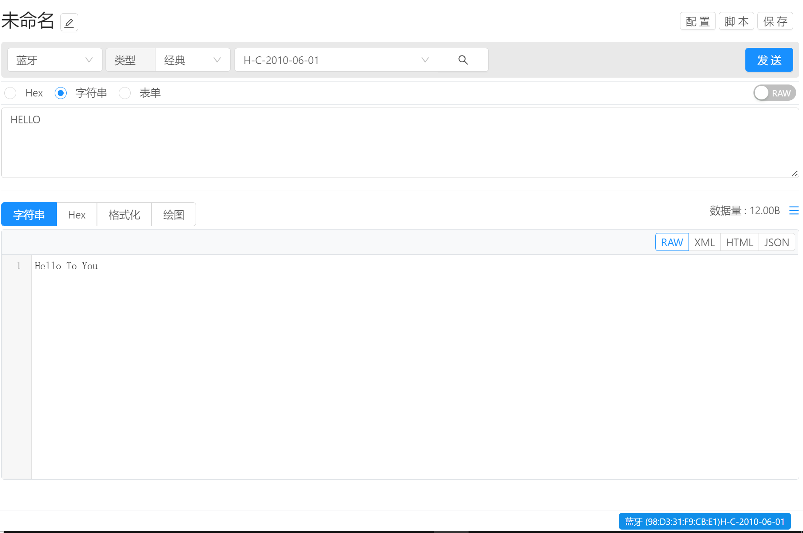
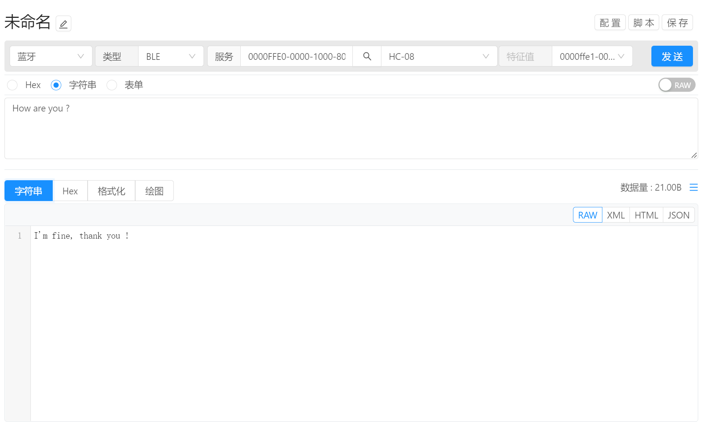

# 指令管理 / 通讯方式 / 蓝牙

将通讯类型选择为蓝牙即可使用蓝牙通讯，蓝牙通讯支持经典模式和BLE模式两种。

## 经典模式通讯配置

- 类型切换为 `经典` 后即可使用经典模式进行蓝牙连接。
- 点击右侧 `放大镜` 图标进行查询周边经典蓝牙设备，当搜索完成后即可在下拉框中选择设备。

## 经典模式数据发送

配置完成后，即可开始配置参数信息，完成后点击 `发送` 按钮即可将参数自动发送给目标设备

## BLE模式通讯配置 

- 将类型选择为 `BLE` 切换为BLE模式
- 服务：输入设备提供的服务标识，支持名称，UUID，别名，输入完成后即可搜索提供该服务的BLE设备。
  - 名称：例如 `alert_notification`,  具体名称可参考 https://www.bluetooth.com/specifications/assigned-numbers/
  - UUID : 例如 `0000FFE0-0000-1000-8000-00805F9B34FB`  大小写不敏感
  - 别名：别名是UUID的缩写版本，例如 `0x1234`
- 设备：服务标识输入完成后，即可点击放大镜图片进行查找设备，可通过放大镜右侧的下拉列表来完成设备的选择。
- 特征值：选择该服务提供的特征值，用于通讯时进行读写操作。

## BLE模式数据发送

配置完成后，即可开始配置参数信息，完成后点击 `发送` 按钮即可将参数自动发送给目标设备

