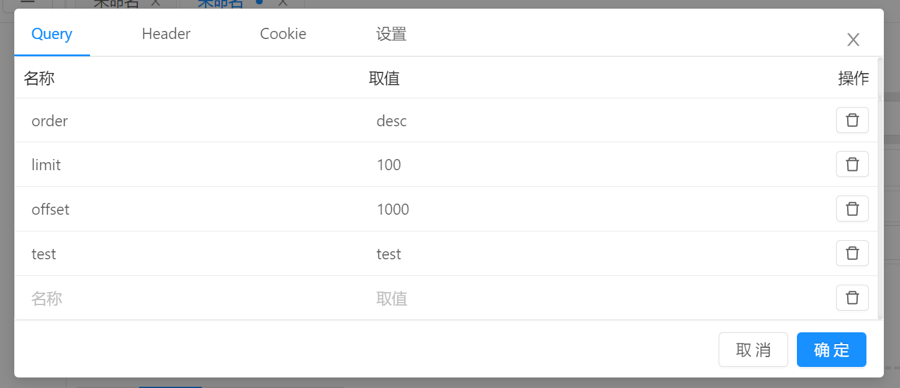
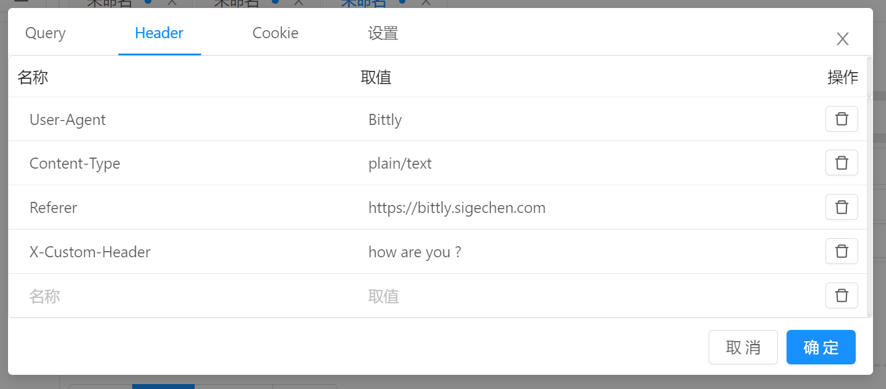
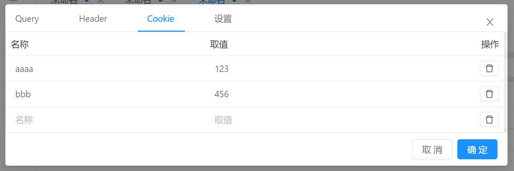
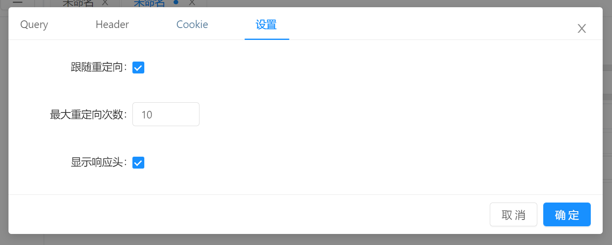
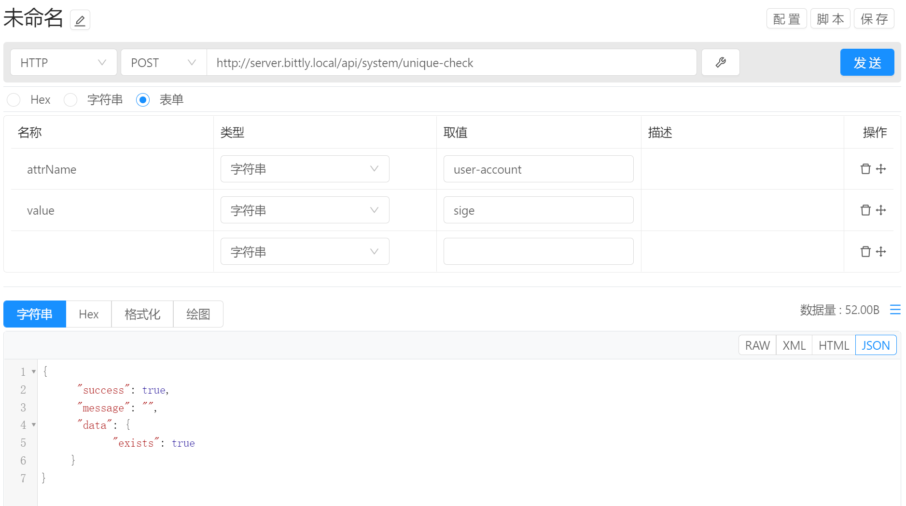

# 指令管理 / 通讯方式 / HTTP

通讯类型选择为 HTTP 即可使用 HTTP 通讯方式。

## 通讯配置

- `请求方式` ：支持请求方式有 `GET`, `POST`, `PUT`, `PATCH`, `DELETE`, `COPY`, `HEAD`, `OPTIONS`, `LINK`, `UNLINK`, `PURGE`, `LOCK`, `UNLOCK`, `PROPFIND`, `VIEW`。 默认为`GET`。
- `请求链接` ：HTTP 请求的链接地址，支持 `http` 和 `https` 。
- `请求配置按钮` ：请求配置按钮用于配置其他请求属性，点击后弹出配置弹框。

## 请求扩展配置

点击 `请求配置按钮` 后弹出请求扩展配置对话框。

### `Query` 

`Query` 配置项用于配置请求的查询参数，该配置将会同步到请求链接中，如上图所示配置，则请求连接会自动更新如下：

### `Header`

`Header` 用于配置请求发送时的 `Header` 信息，名称可通过下拉选择常用Header，当需要的Header不在常用项目列表中时，也支持手动输如 Header 项目名称，例如下图中的 `X-Custom-Header` 即为自定义 Header。

### `Cookie` 

`Cookie` 配置页用于配置发送时附带的 `cookie` 信息， 该信息会被自动填入 `Header` 的 `Cookie` 项目中， 如果 `Header` 的 `Cookie` 项目不为空， 则不进行赋值。

### 设置

这是页用于配置 `http` 请求以及响应的相关信息。

`跟随重定向` : 默认为启用，当启用跟随重定向之后，如果请求响应的头部包含跳转信息，则会自动进行跳转操作，并使用`GET` 的方式去请求跳转目标。

`最大重定向次数` ：当响应头中包含跳转信息时，最大的跳转次数，当超过该限制后将会提示请求失败。 默认为10次。

`显示响应头` ： 默认响应内容不包含Header数据，勾选该项目则会将响应头信息追加到响应内容中并显示出来。 默认为禁用。

## 参数编辑

在请求的 `Header` 中，当 `Content-Type` 为空或不存在时，生成 `Content-Type` 的方式如下：

- `HEX` 模式下，请求 `Header`  的 `Content-Type` 为 `application/octet-stream`

- `文本` 模式下，请求 `Header`  的 `Content-Type` 为 `text/plain`

- `文件` 模式下，请求 `Header`  的 `Content-Type` 为 `application/octet-stream`

- `表单` 模式下，请求 `Header` 的 `Content-Type` 在数据不为空时默认为 `multipart/form-data`，否则默认为`application/x-www-form-urlencoded`；当指定的 `Content-Type` 是 `application/x-www-form-urlencoded` 或者 `multipart/form-data` 时，表单项目的名称为请求参数的`key`, 项目的取值为`value`； 当指定的 `Content-Type` 不是 `application/x-www-form-urlencoded` 或者 `multipart/form-data` 时，请求的数据为该表单所生成的二进制数据。

## 数据发送

配置完成后，点击 `发送` 按钮即可将参数自动发送给目标设备，HTTP 请求参数可为空。

