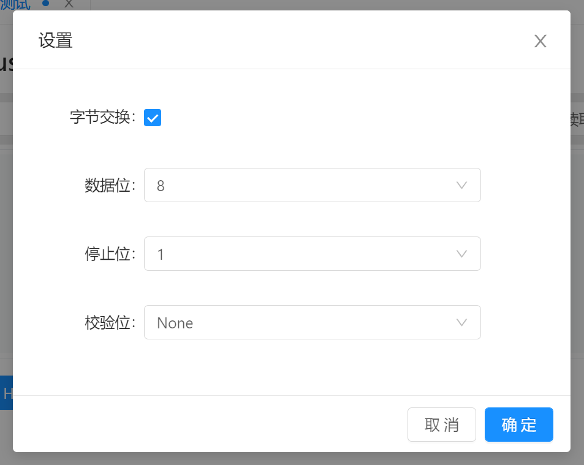
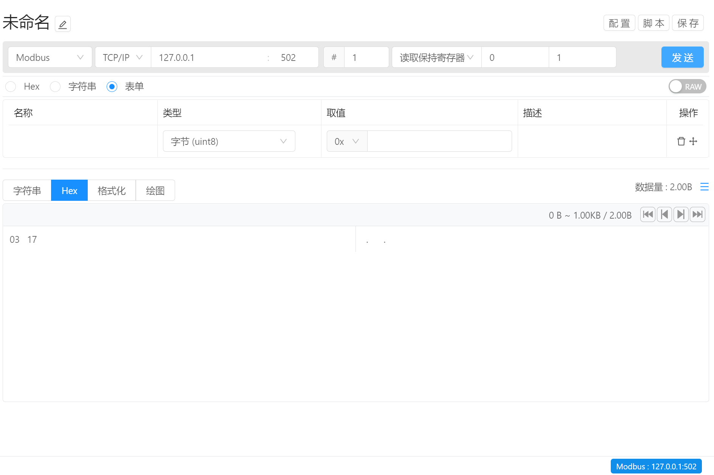

# 指令管理 / 通讯方式 / Modbus

通讯类型选择为 Modbus 即可使用 Modbus 通讯方式。Modbus 类型 支持 Modbus-RTU, Modbus-ASCII 以及 Modbus-TCP

## Modbus-RTU / Modbus-ASCII 通讯配置

- Modbos 类型选择为RTU或者ASCII即可使用.
- `串口号` : 可通过下拉列表选择串口设备或直接手动输入串口号
- `刷新` ：当新设备连接到计算机时，可通过刷新按钮来刷新设备列表，从而通过下拉列表选择串口设备。
- `波特率` : 配置设备与计算机之间串口通讯的波特率，通过下拉的方式选择常用通讯频率，或者手动输入。
- `设备ID` ：配置设备ID
- `功能码`  ：通过下拉的方式选择Modbus操作码，支持 `01H` `02H` `03H` `04H` `05H` `06H` `0FH`  以及`10H` 。
- `数据地址` ：配置读取或者写入操作的数据地址信息，支持使用六十进制标识，例如 `0x01`
- `数据长度` ：配置数据读取的长度，单位为一个字WORD（即两个字节）。
- `扩展配置` ：配置串口通讯的其他信息，例如数据位，停止位，校验方式等。

- `字节交换`  ：默认为未启用。当启用字节交换后，会在大小端的基础上，进行16位的字节交换操作。 例如， 当指令配置为`大端模式` 后，再次勾选 `字节交换` 后，即构成 `大端模式字节交换（BADC）` ，或者当指令配置为 `小端模式` 再勾选 `字节交换` 后，即构成 `小端模式字节交换（CDAB）` 。

## Modbus-TCP通讯配置

- Modbus 类型选择为TCP/IP 即可使用。
- 设备IP地址：输入通讯设备的IP地址
- 设备端口号：输入通讯设备的端口号

## 通用配置

- 设备编号：输入设备编号用于指定通讯设备，默认为1。
- 操作：选择针对该设备进行的操作，支持的操作类型：
  -  读取线圈
  - 读取离散输入寄存器
  - 读取保持寄存器
  - 读取输入寄存器
  - 写入单个线圈
  - 写入单个保持寄存器
  - 写入多个线圈
  - 写入多个保持寄存器
- 操作地址：输入数据读写的地址信息，默认为0
- 操作长度：输入数据写入或读取的字节长度，默认为1

## 数据发送

配置完成后，即可开始配置参数信息，完成后点击 `发送` 按钮即可将参数自动发送给目标设备

最后更新：2022-08-12 四格 

