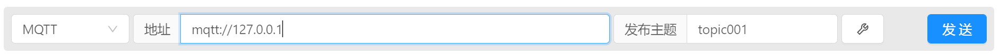
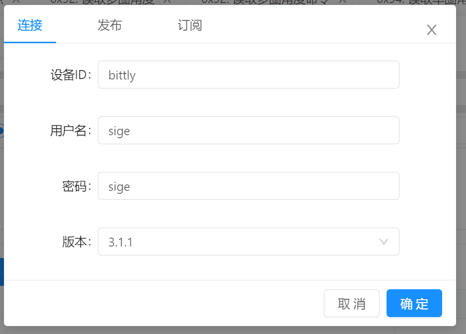
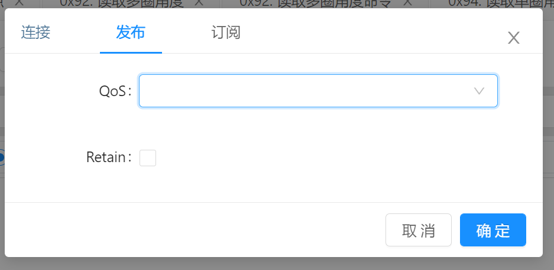
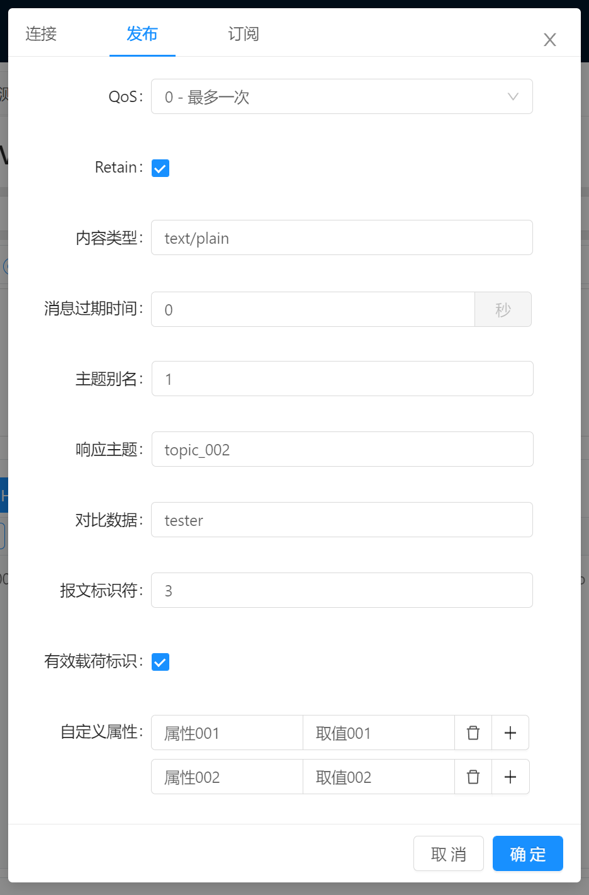
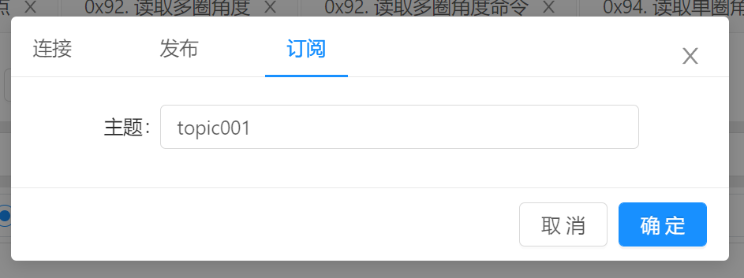
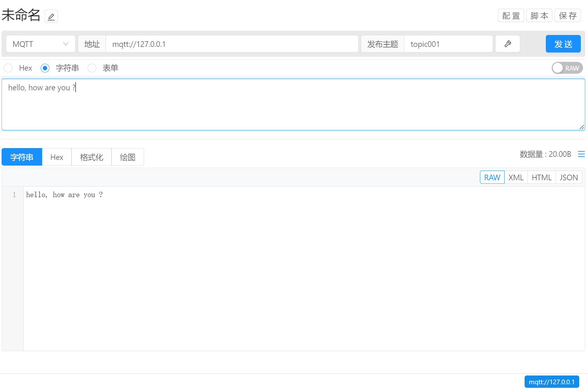

# 指令管理 / 通讯方式 / MQTT

通讯类型选择为 MQTT 即可使用 MQTT 通讯方式。

## 通讯配置

- 地址：输入服务器地址，协议支持 `mqtt`, `mqtts`, `tcp`, `tls`, `ws`, `wss`, `wxs`, `alis`，默认端口号为`1883` 例如：

  协议和地址： `mqtt://127.0.0.1`

  协议，地址以及端口号：`mqtts://127.0.0.1:1883`

- 发布主题：配置参数内容将被发送到的目标主题。

- 通讯配置：点击扳手按钮打开配置弹框，用于配置认证信息或者订阅主题等内容。

  

  - 设备ID ：链接到服务器所显示的设备ID， 设备ID 为空时将会自动生成设备ID，例如：`bittly-123456`
  - 用户名：当服务器启用验证时，连接所需的登录用户名信息
  - 密码：当服务器启用验证时，连接所需的登录密码信息
  - 版本：支持 3.1.1 以及 5.0 版本的MQTT协议，默认为 3.1.1

  

  发布TAB用于配置发布属性

  - QoS：配置消息的可靠性，支持 `0 - 最多一次` `1 - 至少一次`, ` 2- 仅仅一次`， 默认为 0。
  - Retain ：配置是否保留消息，默认为否。

  

当采用 `5.0` 版本时可配置的选项：

- `内容类型` ：（Content Type）描述遗嘱消息或 PUBLISH 消息的内容类型，例如：`text/plain`

- `消息过期时间` ：（Message Expiry Interval）消息过期时间，单位为 `秒`。

- `主题别名` ：（Topic Alias） 配置主题数值别名。

- `响应主题` ：（Response Topic）配置发布后的响应主题名称。

- `对比数据` ：（Correlation Data）配置消息对比数据内容。

- `报文标识符` ：（Subscription Identifier） 配置报文标识符。

- `有效载荷标识` ：（Payload Format Indicator）配置有效载荷标识。 

- `自定义属性` ：（User Properties）配置自定义属性，可添加多组，需要注意的是当名称为空时，该属性将会被忽略。
  
  
  
  
  
  配置订阅信息
  
  - 主题：订阅该主题作为响应内容显示，既发布到该主题的内容将显示在响应区域。

## 数据发送

配置完成后，即可开始配置参数信息，完成后点击 `发送` 按钮即可将参数自动发送给目标设备

