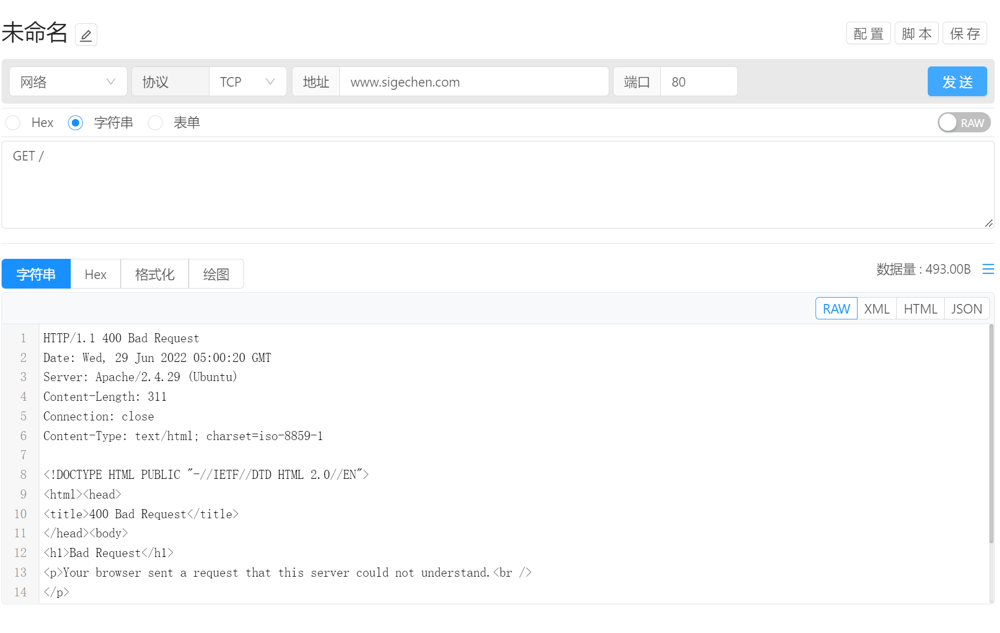

# 指令管理 / 通讯方式 / 网络

网络通讯方式用于进行网络通讯调试。支持 TCP 和 UDP 两种协议。

## 通讯配置

网络通讯支持TCP和UDP两种协议，可在协议下拉框中进行切换。通讯类型选择为网络即可进行网络通讯配置。

- 通讯类型选择为 `网络` 即可进行网络通讯配置
- 协议：目前支持TCP和UDP两种协议，默认TCP
- 地址：通讯目标IP或域名，支持IPv6
- 端口号：通讯目标的端口号 

## 数据发送

配置完成后，即可开始配置参数信息，完成后点击 `发送` 按钮即可将参数自动发送给目标设备

