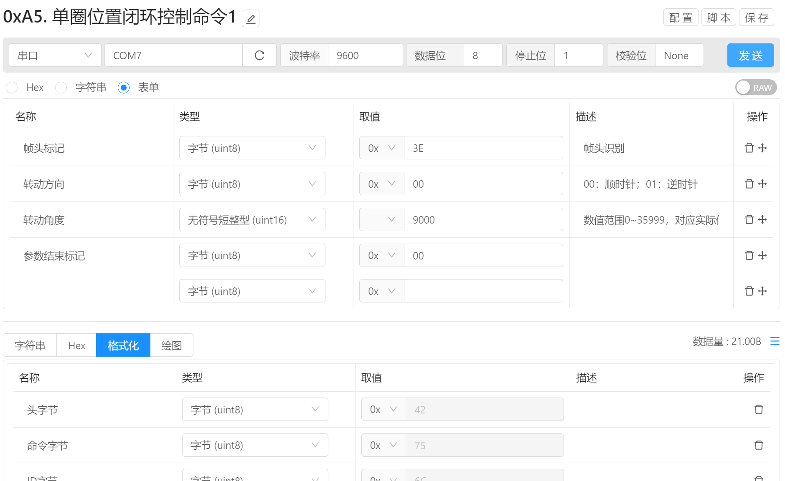

# 指令管理 / 通讯方式 / 串口

串口通讯方式用于进行串口设备通讯调试。

## 通讯配置

将通讯目标类型选择为串口后即可进行串口通讯的配置，配置完成后即可写入参数并点击 `发送` 按钮进行数据发送操作。

- 通讯类型选择为 `串口` 即可使用该通讯方式。
- 串口选择：点击右侧串口刷新按钮即可刷新当前已经链接的串口设备，完成后即可查看并选择对应的串口设备，当设备不存在或者未在设备列表中时，可手动填写串口号或路径。
- 波特率：输入通讯使用的波特率配置项，可通过下拉列表选择常用的通讯频率，当常用的通讯频率无法满足时，可手动输入通讯频率，但是需要注意的是，手动输入非常用的通讯频率可能会发生未定义的错误。
- 数据位：选择通讯使用的数据位配置，目前支持 5,6,7,8，默认为 8
- 停止位：选择通讯使用的停止位配置，目前支持 1,1.5,2, 默认为 1
- 校验位：选择通讯使用的校验位配置，目前支持 None, Odd, Even, Mark, Space。 默认为 None

## 数据发送

配置完成后，即可开始配置参数信息，完成后点击 `发送` 按钮即可将参数自动发送给目标设备

