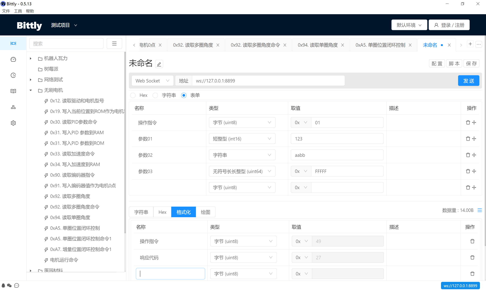

# 指令管理 / 通讯方式 / WebSocket

通讯类型选择为 websocket 即可使用 Websocket 通讯方式。

## 通讯配置

- 地址：输入服务器地址，支持 ws 和 wss 协议，例如：

  协议和地址： `ws://127.0.0.1`

  协议，地址以及端口号：`ws://127.0.0.1:8899`

  协议，地址，端口号以及路径 : `ws://127.0.0.1:8899/demo-path`

  wss 协议：`wss://websocket-echo.com`

说明：`websocket-echo.com` 可用于测试，该服务器将会返回任何发送给该地址的数据。

## 数据发送

配置完成后，即可开始配置参数信息，完成后点击 `发送` 按钮即可将参数自动发送给目标设备

