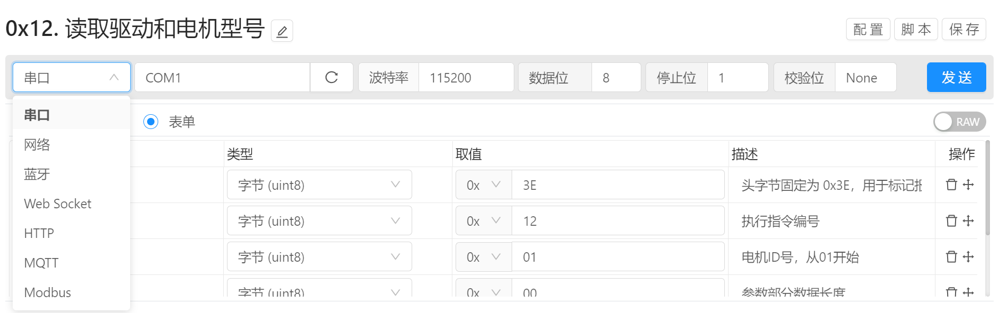

# 指令管理 / 通讯方式

Bittly 目前支持串口，网络，蓝牙，Web Socket, Http, MQTT, 以及 Modbus 等通讯方式。 根据通讯方式的不同，其通讯目标的配置方式也有所区别。

[**串口**](/manual/directive-communicator-serialport) ：用于串口通讯调试，支持获取设备列表，波特率配置，以及数据为，停止位，校验位的配置。

[**网络**](/manual/directive-communicator-network) ：用于网络通讯调试，支持TCP，UDP两种协议。

[**蓝牙**](/manual/directive-communicator-bluetooth) ：用于蓝牙通讯调试，支持经典蓝牙，以及BLE。

[**Web Socket**](/manual/directive-communicator-websocket) ：用于Web Socket协议调试，支持 ws 和 wss。

[**HTTP**](/manual/directive-communicator-http) ：用于 HTTP 协议调试。

[**MQTT**](/manual/directive-communicator-mqtt) ：用于 MQTT 协议调试。

**[Modbus](/manual/directive-communicator-modbus)** ：用于 Modbus 协议调试， 支持 Modbus-RTU, Modbus-ASCII 以及 Modbus-TCP

