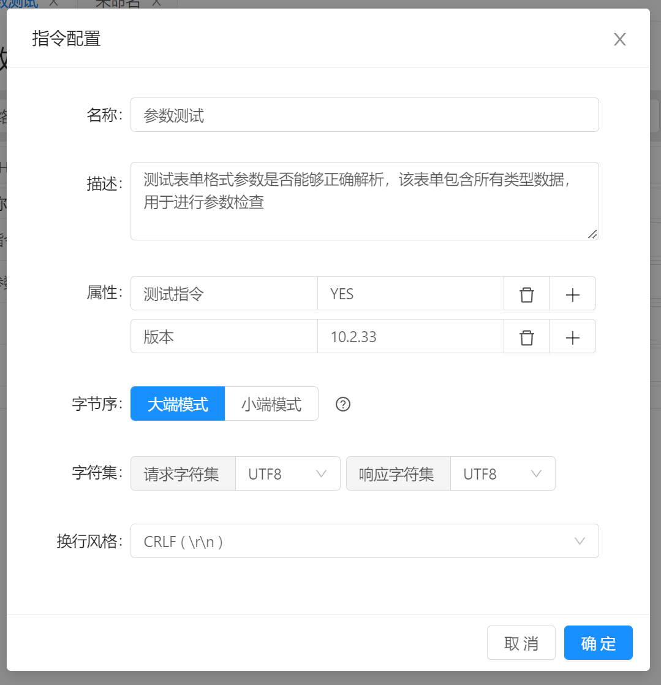

# 指令管理 / 指令配置

点击 `配置` 弹出配置对话框，通过该对话框进行指令属性配置。 配置完成后，需要点击 `保存` 才会将配置信息保存，否则只适用于本次修改。

指令配置属性说明：

- `名称`  ：指令显示名称，用于快速识别以及说明指令。
- `描述`  ：指令详细说明信息，可用于针对指令使用方式，情景等说明。
- `属性` ： 编辑指令元数据，属性以名称/值的形式进行配置，可在文档输出时显示。
- `字节序` : 配置指令字节序，字节序配置将影响表单，数据解析等需要处理多字节数据的场景。
- `字符集` ：配置发送和响应内容字符集，默认为 UTF8 编码。
- `换行风格` : 配置指令参数字符串换行风格，默认或为空时不做处理。 例如当换行风格为 `\r\n` 时，字符串中的所有换行将会被替换为 `\r\n` 。 