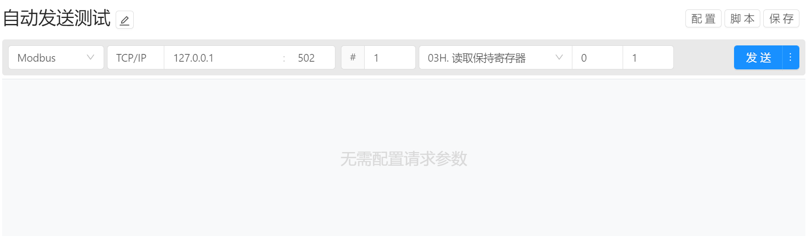
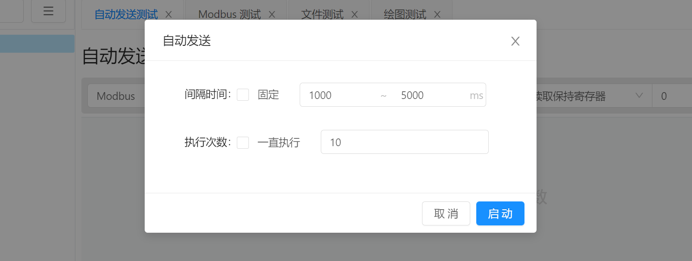
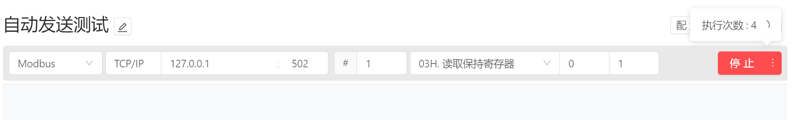

# 指令管理 / 指令执行

在指令请求时可通过执行请求脚本来进行动态修改指令数据，例如生成字段或这属性值。

当通讯方式和请求参数配置完成后，即可点击 `发送` 按钮，将配置的请求参数发送至通讯目标。 目前支持单次发送和自动发送两种模式。

## 单次发送

点击 `发送` 按钮即可执行单次发送操作， 单次发送模式下，当指令完成之后无任何其他操作，用户可通过再次点击 `发送` 按钮来发送执行指令发送操作。

## 自动发送

通过点击 `发送` 按钮右侧的菜单按钮触发发送下拉菜单，选择 `自动发送` 条目即可开始配置自动发送功能。

`间隔时间` ：配置每次自动发送时的指令间隔时间，单位为毫秒数。 当勾选`固定` 时，则只需要填写一个固定的间隔时间即可。 当未启用 `固定` 模式时，则需要填写最小间隔时间和最大间隔时间。 当自动执行启动时， 将会在最小间隔时间和最大间隔时间随机生成延时。

`执行次数` ：当勾选 `一直执行` 时，不需要填写执行次数，指令会根据间隔时间一直执行下去，当未勾选 `一直执行` 时，可通过填写执行次数来限制自动发送执行的次数。

当自动发送执行后，`发送` 按钮变为 `停止` 按钮，可随时通过点击该按钮来中断自动执行操作。 当任务执行完毕之后，该按钮变回 `发送` 按钮。