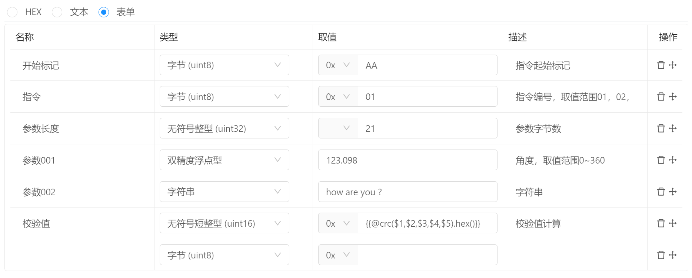
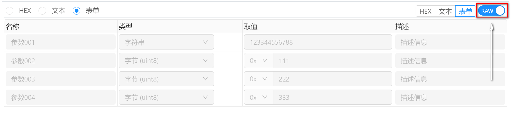

# 指令管理 / 参数构建 / 表单

参数类型选择为 `表单` 即可使用表单模式进行参数编辑。

## 参数编辑

- `名称` ：

  名称用于标记字段属性名称，如果是结构化数据，推荐成结构名称，例如 `name` 或者 `age` 等。

  每中通讯对于字段名称的处理方式不同，例如在执行http请求时，名称会被作为参数的键名处理，详情请参考通讯目标说明。

- `类型` ：

  类型用于说明字段数据类型，不同的数据类型其对应的值编辑器也会不同。 目前支持的数据类型如下：

  - `字节 (uint8)` : 用于输入单个字节值，数据长度为1字节，例如 : `123`
  - `单字节整型 (int8)` : 有符号单字节值，数据长度为1字节，例如 : `123`
  - `字符 (int8)` : 用于输入单个字符，例如 : `A`
  - `无符号字符 (uint8)` : 用于输入单个字符。但数据类型为无符号。，例如 : `Y`
  - `短整型 (int16)` : 用于输入有符号短整型数据， 数据长度为2个字节，例如 : `123`
  - `无符号短整型 (uint16)` : 用于输入无符号短整型数据，数据长度为2个字节，例如 : `123`
  - `整型 (int32)` : 用于输入有符号整型，数据长度为4个字节，例如 : `123`
  - `无符号整型 (uint32)` : 用于输入无符号整型，数据长度为4个字节，例如 : `123`
  - `长整型 (int32)` ：用于输入有符号长整型数据，数据长度为4个字节，例如 : `123`
  - `无符号长整型 (uint32)` ：用于输入无符号长整型数据，数据长度为4个字节，例如 : `123`
  - `长长整型 (int64)` : 用于输入有符号长长整型数据，数据长度为8个字节，例如 : `123`
  - `无符号长长整型 (uint64)` : 用于输入无符号长长整型数据，数据长度为8个字节  例如 : `123`
  - `单精度浮点数 (float)` : 用于输入单精度浮点数，数据长度为4个字节,  例如 : `123.11`
  - `双精度浮点数 (double)` ：用于输入双精度浮点数，数据长度为8个字节， 例如 : `123.11`
  - `字符串` : 用于输入字符串数据类型，数据长度为字符串长度。例如：`how are you ?`
  - `字节组` ：用于输入字节数组，数据长度为字节数组数据长度。 例如： `00 AA BB FF`

  其中，无符号数据类型支持二进制，八进制，十进制，十六进制格式输入。

- `取值` ：

  取值编辑器用于编辑字段值，根据数据类型支持不同的数据输入。 当数据类型为无符号时，可选择二进制，八进制，十进制，十六进制数据格式编辑。

  数据格式前缀：`0b` ：二进制；`0` ：八进制； ` 空白` ：十进制； `0x`：十六进制；

  当数据格式发生变化时，如果取值的内容能够有效转为目标进制，则会自动进行转换操作，否则保留当前数值。

  取值编辑器支持占位符编辑， 目前支持的占位符如下：

  - 脚本数据占位符 `{{xxx}}` : 用于获取脚本计算完成后的结果数据。当对应的占位符对应的数据不存在时，该占位符的取值为空。
  - 环境变量占位符 `{{env.name}}` : 用于获取当前环境变量中的数据，当对应的环境变量不存在时，该占位符为空。
  - 快捷调用 `{{@functionName(p1,p2)}}` : 用于获取快捷调用后的值，快捷调用的函数来自 `bittly` 和 `project` 脚本。例如：`{{@crc('12345678')}}`， 则会调用 `bittly.crc` 函数，如果在项目脚本中同样存在 `crc` 函数，则会调用 `project.crc` 而不调用 `bittly.crc`。 既在快捷调用时，项目脚本的优先级大于Bittly的全局脚本。**参数传递** ： 对于快捷调用的参数传递，可直接传递常量数据，例如1,'1234',{name:'xxx'} 等，对于引用其他字段的数值，可采用 `$num` 的方式进行，`num` 为当前表单中的条目索引，索引号从 `0` 开始，而不是从`1` 开始。  例如 `$0` 标识该表单中的第一个属性`开始标记` 。传递到参数内部时， `$0` 即为整个条目对象，包括名称，类型，格式，描述等属性。

- `描述`

  描述用于针对字段进行详细的描述说明。例如取值范围或者作用方式等。

## 实际数据查看

当参数数据被发送出去之后，便会出现 `RAW` 查看开关，打开该开关即可查看发送的实际数据，也就是计算处理之后的数据。通过切换 HEX，文本、表单来切换不同的查看方式。

当请求方式非表单时，查看实际数据时无法使用表单模式查看实际发送数据。