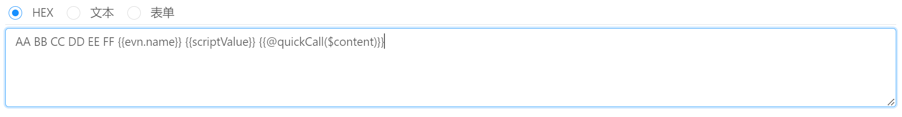
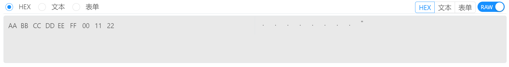

# 指令管理 / 参数构建 / HEX

参数类型选择为 `HEX` 即可使用十六进制模式进行参数编辑。

## 参数编辑

十六进制模式可用来直接输入字节信息。 Bittly 在处理十六进制输入时：

- 输入框中的所有空白符将会被忽略
- 支持环境变量占位符 `{{evn.name}}` ， 脚本变量占位符 `{{name}}` 以及快捷调用 `{{@quickCall($content)}}`
- 使用快捷调用时，`$content` 标识当前已经处理后的字符串内容，例如： 示例中假设环境变量值为`00`,脚本变量为`11`, 则  `$content` 的值为 `AA BB CC DD EE FF 00 11 {{@quickCall($content)}}`.
- 在处理十六进制数据时，会有限处理环境变量，然后脚本变量，最后是快捷调用的处理。

## 实际数据查看

当参数数据被发送出去之后，便会出现 `RAW` 查看开关，打开该开关即可查看发送的实际数据，也就是计算处理之后的数据。通过切换 HEX，文本、表单来切换不同的查看方式。

当请求方式非表单时，查看实际数据时无法使用表单模式查看实际发送数据。