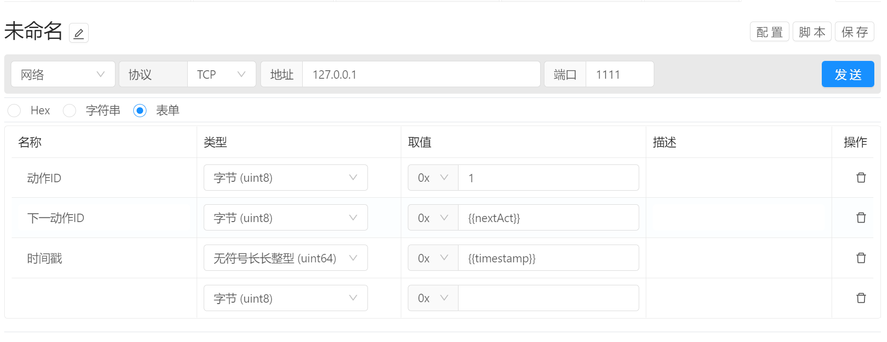

# 指令管理 / 参数构建

请求参数支持 Hex, 字符串，以及表单三种构建方式。

**[HEX](/manual/directive-parameter-hex)** ：十六进制字节参数构建

**[字符串](/manual/directive-parameter-text)** ： 文本格式参数构建

**[表单](/manual/directive-parameter-form)** ：结构化的参数构建，支持多种数据类型，以及多种进制格式。省去大小端，进制转换以及数据计算的步骤。

 **[字符串类型数据](/manual/directive-parameter-datatype-string)**  : 字符串类型数据构建说明

