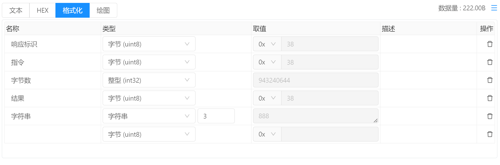
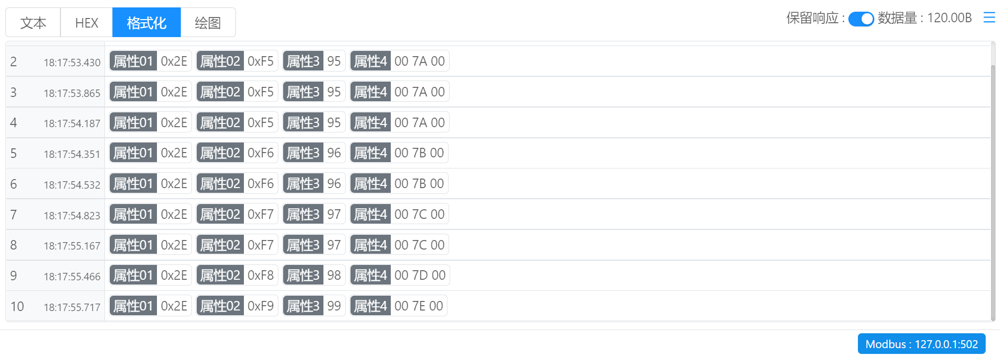
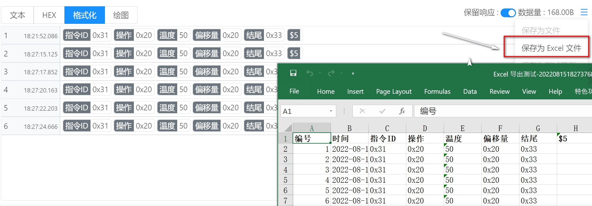
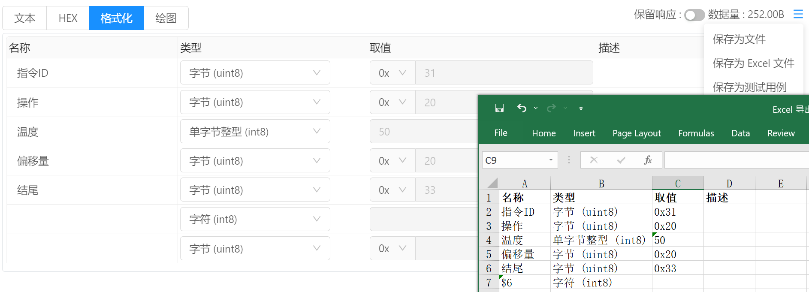

# 指令管理 / 响应查看 / 格式化

选择 `格式化` 即可使用格式化模式进行响应数据查看，默认情况下，格式化显示数据为空，需要手动创建解析方式，创建完成后可点击保存按钮将解析方式进行保存，后续执行时将会自动进行解析，而不用再次手动操作。

`名称` ：描述该响应字段属性名称，例如结构属性名。

`类型`：描述该字段数据类型。

- 当该字段的数据长度不固定时， 则需要手动输入字段长长度，例如字符串或者字节数组这两种数据类型。
- 当指定的长度超过响应数据时，则解析到数据末尾时结束，剩余的字段不再继续解析。 例如一共有5个字段， 字段 A,B,C,D,E， 响应数据一共10个字节，如果指定字段A为字符串，并且长度为15，那么所有的数据都会被解析到字段A中，剩余的字段不会被分配到数据。

`取值` ：显示当前字段解析出的取值。

`描述` ：为当前字段增加描述信息，便于明确字段含义。

`操作` :  `删除` 用于删除当前字段。

## 保留响应 模式

当启用 `保留响应` 模式时，表单根据配置的属性进行数据解析，并将每次的响应结果以列表的形式进行展示。

## 导出响应结果为Excel

格式化模式支持将响应结果导出为Excel文件便于进行二次分析，例如：

保留响应模式下：

单响应模式下：

