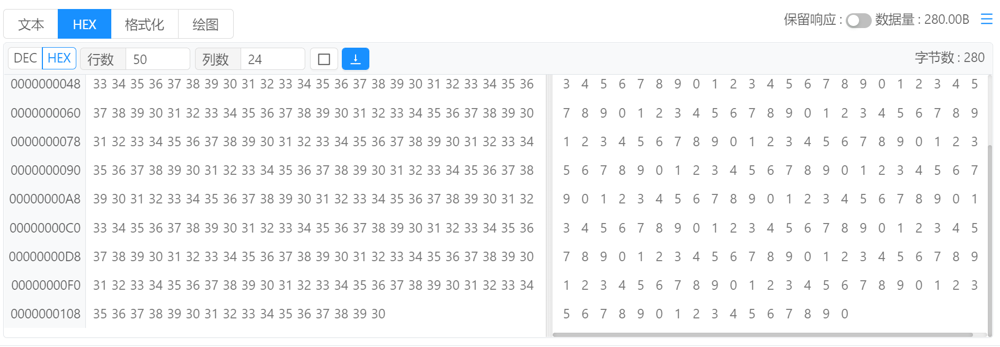
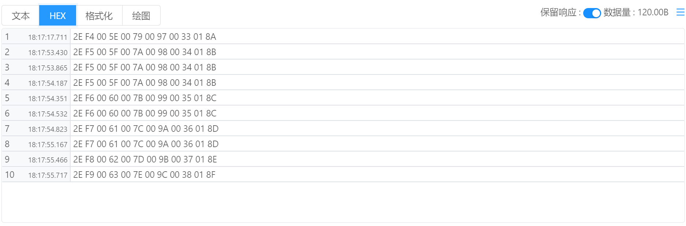

# 指令管理 / 响应查看 / HEX

将响应查看方式选择为 `HEX` 即可使用HEX模式查看请求响应。

`DEC | HEX` : 切换地址显示方式，十六进制或者十进制模式。

`行数` ：响应结果展示最多行数限制， 超出该行数限制后顶部的数据将会被移出显示区域。

`列数` ：HEX区域响应结果展示的列数，该属性也可通过使用鼠标拖动分割条来动态调整。

`□（清空显示区域）`：清空当前显示区域，当响应持续不断的接收时，可通过该按钮清空显示区域。

`↓（自动滚动到底部）` ：默认为开启状态，当收到响应内容后，显示区域将会自动滚动到最底部区域来显示最新响应内容。

`字节数` ：显示当前请求收到的响应内容的字节数。

## 显示区域调整

在HEX模式下，可通过拖拽分隔栏来调整HEX区域的显示大小，方便进行数据对比。

## 保留响应模式

当启用`保留响应` 模式后，则会采用表格的方式进行显示每次请求响应的数据。