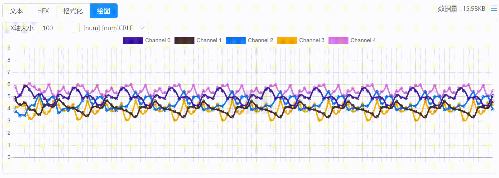
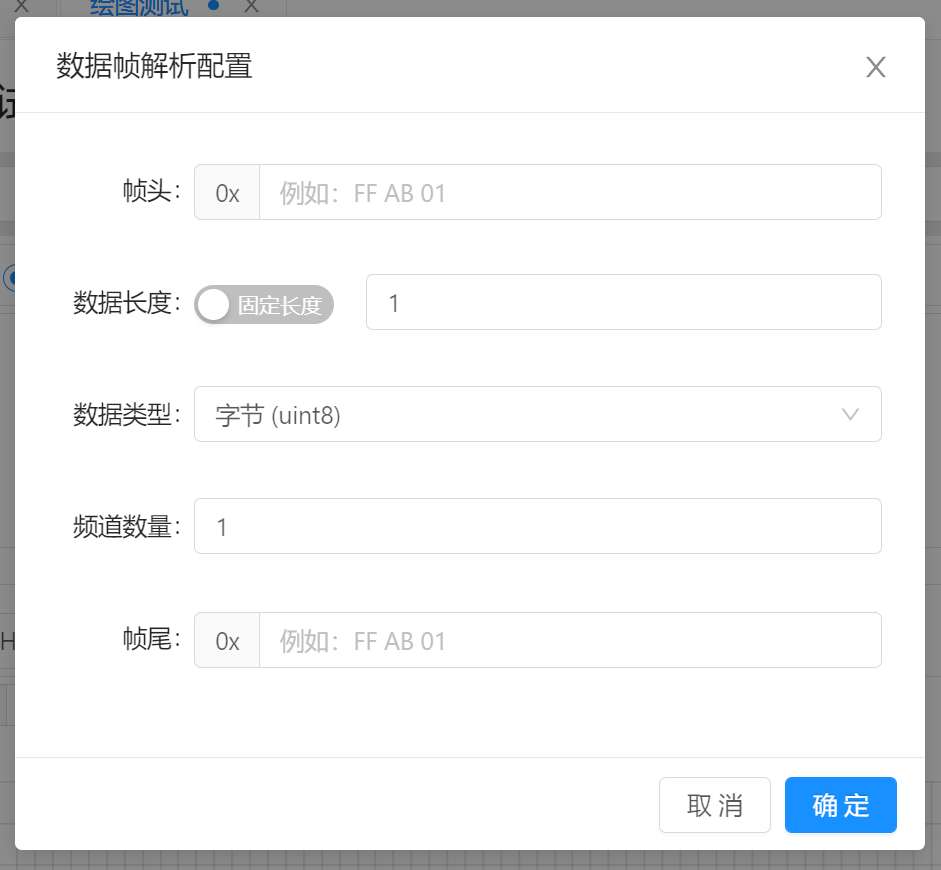
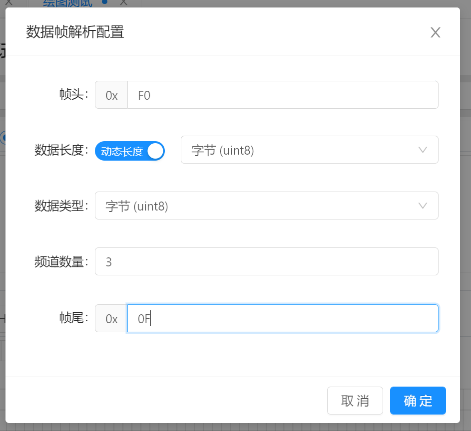
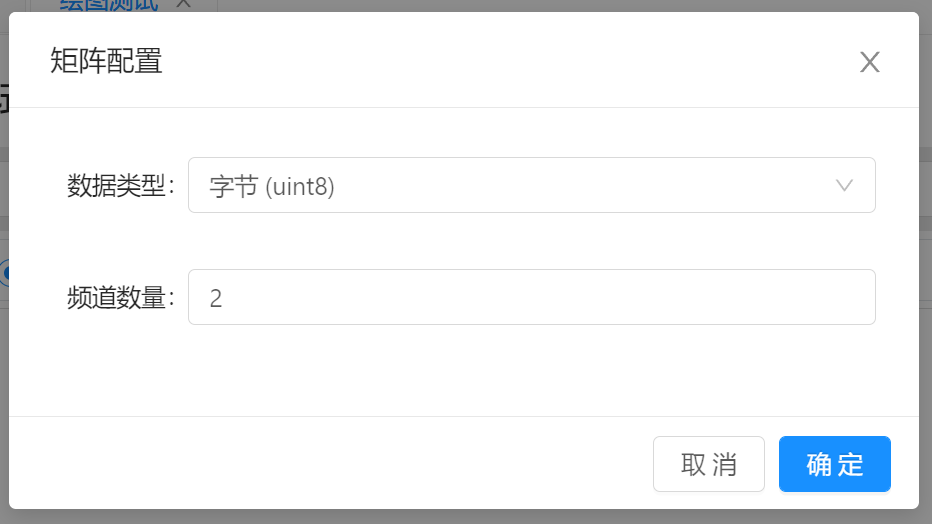
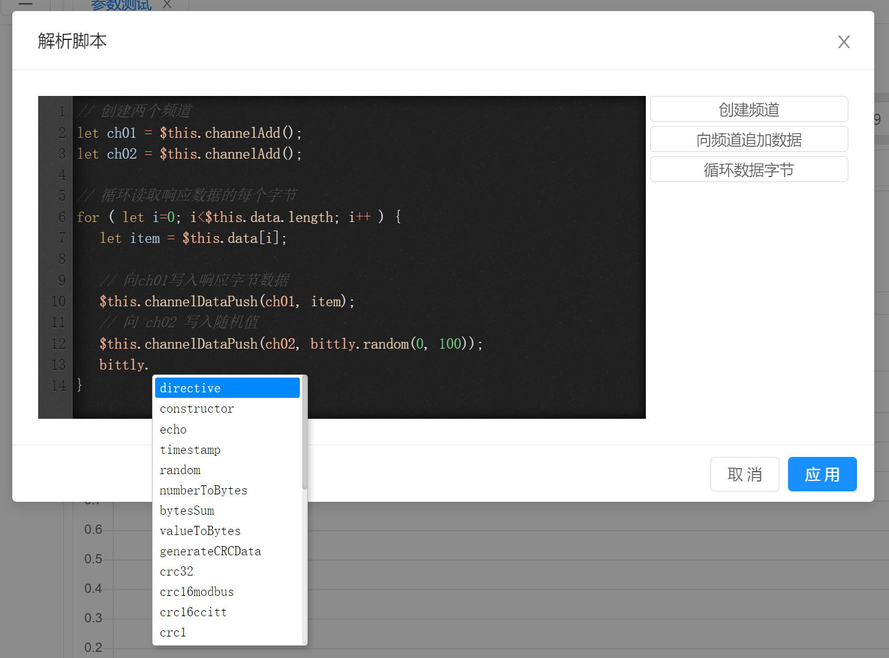
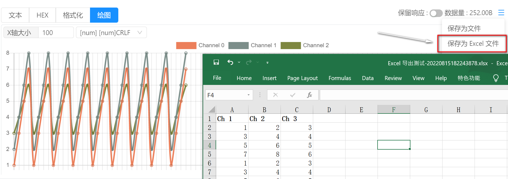

# 指令管理 / 响应查看 / 绘图

选择查看模式为`绘图` 即可使用折线图模式查看。



绘图目前最高支持同时处理50个频道，超出该数量将不再进行处理。

- `X轴大小` ：定义X轴大小，默认为100，则X轴最多可同时显示100个数据点。

- `解析协议` : 选择用于解析数据的协议。支持内建解析模式以及自定义解析模式。 默认为 `[num] [num]CRLF` 格式。 协议详情参考下方解析协议。

  

## 解析协议

### [num] [num]CRLF

该协议为默认的数据解析方式，它将数据以文本的方式进行解析，每行作为一个数据组，例如：

```bash
123 345 789\r\n111 222 333\r\n567 789 1211\r\n
```

则，解析出的结果为

```
第一个 Channel : [123, 111, 567],
第二个 Channel : [345, 222, 789],
第三个 Channel : [789, 333, 1211],
```

- 数据中的第一行的元素数量会被作为频道数量处理，当后续的行中的元素少于频道数时，则后续的频道值会补0；当多余当前频道数时，则会被丢弃。
- 数值与数值之间的间隔为1个英文空格。
- 如果首行为空白，则会忽略首行，并使用第一个不为空的行开始解析。若找不到有效的数据行，则解析结果为空。

- 对于无法解析的数据，将会被置为0处理。 例如 `aa`, `1hhh222` 等


### 数据帧解析

数据帧解析用于解析基于 `Header + Length + Data + Tail ` 格式的数据帧数据。 例如假设数据：

```
假设数据：F003AABBCC0F
```

其中： `F0` 为帧头（header）用于标识数据帧的开始 , `03` 标识数据长度 （Length）标识数据区域的字节数，`AABBCC` 则代表3个字节的数据内容（Data），以及 `0F` 为帧尾 (Tail) 用于标识数据帧结束。

解析配置方式如下：



- `帧头` ：配置帧头匹配的字节数据，为空时则不匹配帧头。 当配置了帧头时，只有匹配了帧头之后才会继续匹配后续数据。 
- `数据长度` ：数据长度支持 `固定长度` 和 `动态长度` 两种模式，当处于动态长度时，可配置用于读取长度的数据类型，例如一个字节，一个字，或者整型，长整型等。
- `数据类型` ：指示数据区域内的每个元素的数据类型。用于解析时能够正确的进行数据转换。
- `频道数量` ：指示数据区域可用于多少个频道，假如频道数量为1，并且数据类型为字节，那么数据区域的每个字节都是该频道的数据元素。 如果频道数量为2，并且数据类型为字节，数据量为6个字节，那么， 第一个字节属于第一个频道， 第二个字节属于第二个频道，第三个字节属于第一个频道，第四个字节属于第二个频道，以此类推。
- `帧尾` ：配置帧尾的字节数据，为空时则不匹配帧尾。**如果 `帧头,数据长读,数据` 都匹配成功，最后帧尾匹配失败，则将会从数据末尾重新开始匹配帧头。** 

以上述数据为例， 则配置为：



假设数据为`F003AABBCC0FF003EEFF000F` ,则如果 `频道数量` 配置为3时：

```
频道1 : [AA, EE]
频道2 : [BB, FF]
频道3 : [CC, 00]
```

如果频道数量为1时 ：

```
频道1 : [AA, BB, CC, EE, FF, 00]
```


### 数据矩阵

数据矩阵是将响应数据作为二维数组来进行处理， 素组的每一列作为频道数据进行处理。

例如，配置数据类型为字节， 频道数量为2，响应数据为 `01020304`, 则频道信息为：

```
频道1 : [01, 03]
频道2 : [02, 04]
```

配置信息



- `数据类型` : 配置频道元素的数据类型，用于从响应数据中提取元素时使用。
- `频道数量` ：输出的频道数量，也可以看作为二维数组的列数。


### 自定义解析 

当内置的解析方式无法满足需要时，即可使用自定义解析模式。 自定义解析模式需要手动书写解析脚本并生成频道数据。例如：



在每次进行解析时，都会清除掉之前的所有数据，所以解析脚本需要每次解析全部的数据。

编辑解析脚本时，可使用右侧的快捷键来生成代码模板，然后根据自己的需要进行适当的修改。

脚本中的特殊变量

- `$this` ：代表当前解析器。
  - `$this.data` ：响应数据字节数组
  - `$this.channelCreate()` : 创建一个空白频道，并返回一个频道ID，后续针对频道操作时会用到。
  - `$this.channelDataPush($cid, $data)` : 向频道中追加数据。 `$cid` 为频道ID， `$data` 为数值数据。
- `bittly` :  通过 `bittly.` 来使用内置的常用函数。

例如：

```javascript
// 创建两个频道
let ch01 = $this.channelAdd();
let ch02 = $this.channelAdd();

// 循环读取响应数据的每个字节
for ( let i=0; i<$this.data.length; i++ ) {
  let item = $this.data[i];
  
  // 向ch01写入响应字节数据
  $this.channelDataPush(ch01, item);
  // 向 ch02 写入随机值
  $this.channelDataPush(ch02, bittly.random(0, 100));
}
```


## 响应导出 Excel 文件

绘图模式下支持将响应结果导出为Excel文件, 方便用于进行二次处理，在导出的文件中，每个频道数据将在同一列进行存储，例如：

