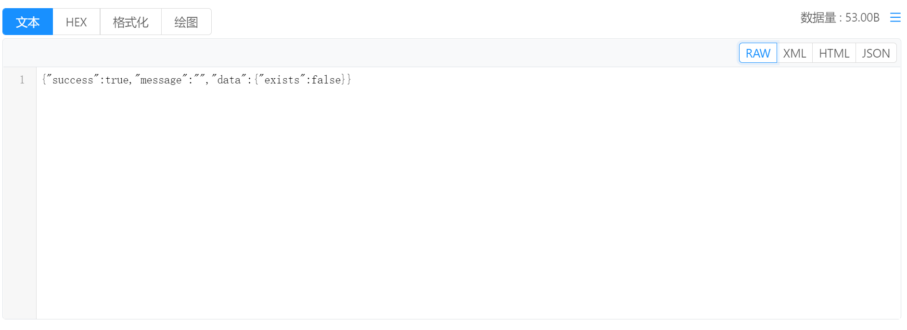
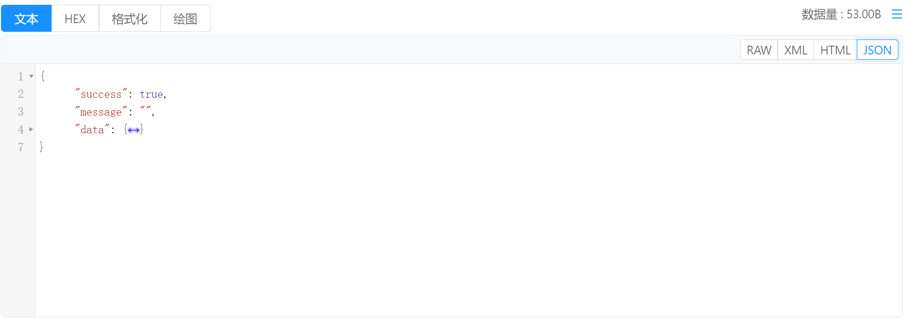
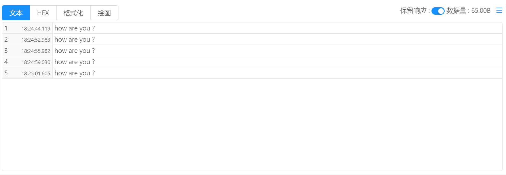

# 指令管理 / 响应查看 / 文本

将响应查看方式选择为 `文本` 即可使用文本模式查看请求响应。

查看格式：

`RAW` ：原始模式，查看时内容无任何修改。

`XML` : 查看时内容无任何修改，但是关键字或标签会被高亮显示, 并在区块区域可进行折叠。

`HTML` : 查看时内容无任何修改，但是关键字或标签会被高亮显示, 并在区块区域可进行折叠。

`JSON` : 查看时内容会被自动进行格式化对齐，并可通过折叠按钮折叠，例如：

## 保留响应模式

当启用 `保留响应` 模式后，会以表格的形式显示每次执行指令后获取的响应数据。