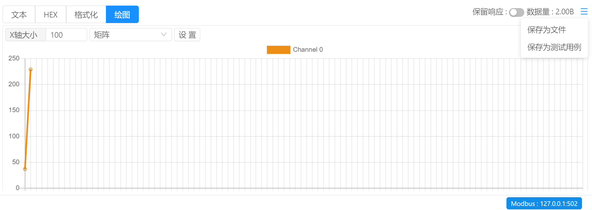

# 指令管理 / 响应查看

Bittly 目前支持十六进制，文本，绘图，以及格式化这四种响应查看方式。

`查看模式` ：目前支持文本，HEX，格式化，绘图四种模式，可通过切换标签来切换查看模式。

`保留响应` ：默认情况下，响应查看区域只显示本次指令发送的响应内容。 当启用 `保留响应` 模式后， 每次的响应内容都会展示到响应查看区域内。

**右侧菜单按钮功能**

- `保存为文件` : 将响应结果保存为文件。点击后将弹出文件保存对话框，完成对话框操作后即可将响应数据保存为文件。

- `保存为测试用例` ：将本次响应结果以及请求参数保存为测试用例。

**响应查看模式**

[**HEX**](/manual/directive-response-hex) : 十六进制字节模式查看响应数据

[**文本**](/manual/directive-response-text) ：文本模式查看响应数据

[**格式化**](/manual/directive-response-form) ： 结构化解析模式查看响应数据

[**绘图**](/manual/directive-response-plotter) ：波形图绘制模式查看响应数据

