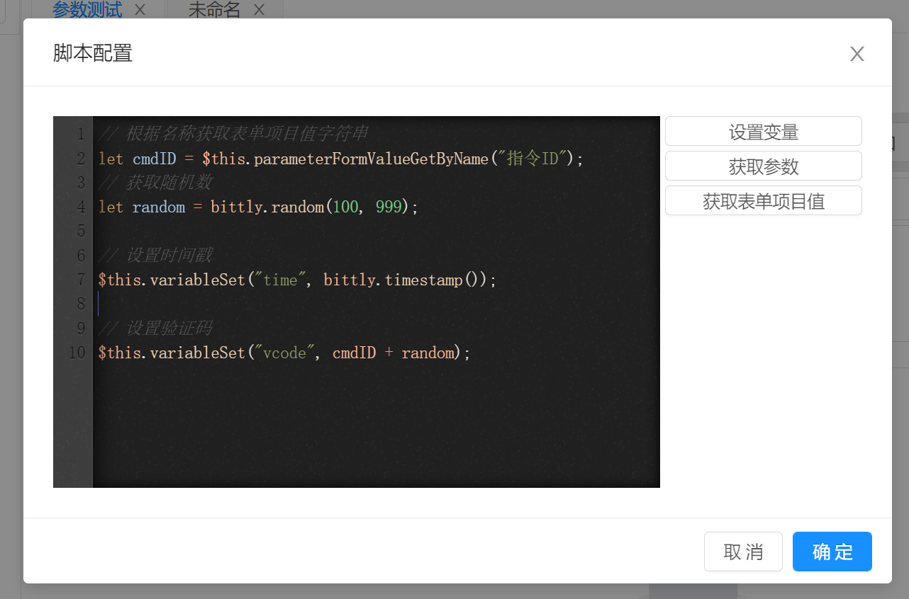
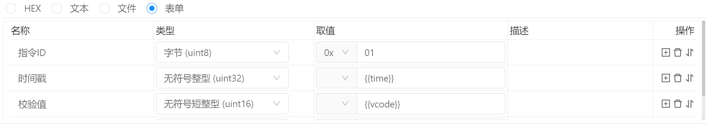
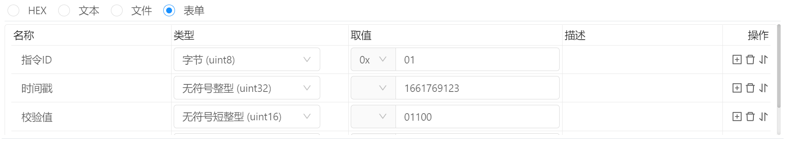

# 指令管理 / 请求脚本

在指令请求时可通过执行请求脚本来进行动态修改指令数据，例如生成字段或者属性值。




## 使用方式

我们先假设有如下请求参数：



其中 `时间戳` 参数每次发送请求的时候需要获取当前时间并发送，`校验值` 的计算方式是为 `指令ID + 一个随机数` 构成。

那么，每次手动来书写时间戳和校验值肯定是不合适的，所以我们可以通过脚本来实现。 脚本如下：

```javascript
// cmdId 为定义的临时变量。
// $this.parameterFormValueGetByName("指令ID") 用来通过名称获取参数值
// 则 cmdId 为字符串 "01"
let cmdId = $this.parameterFormValueGetByName("指令ID");

// 生成一个随机数用于计算校验值
// 假设 random 为 100
let random = bittly.random(100, 999);
// vcode 结果为 "01100"
let vcode = cmdId + random; 
// 设置占位符 {{vcode}} 的值
$this.variableSet("vcode",cmdId * 1 + random);

// 设置时间戳占位符 {{time}}
$this.variableSet("time", bittly.timestamp());
```

当点击 `发送` 按钮后，`{{vcode}}` 和 `{{time}}` 将会被替换为计算后的值， 则实际发送的内容为：




## 设置变量

```javascript
// 为 {{name}} 变量赋值，这样就可以参数中使用 {{name}} 变量
// 例如，如果参数为文本格式： "Hello! {{name}}"
// 则实际发送的结果为 : "Hello! sige"
// 变量名必须以因为字幕开头，即[A-Za-z]
$this.variableSet("name", "sige");
```


## 获取参数

```javascript
// 当请求格式为表单时，参数为数组，数组的每个元素为一个对象，包括name,type,format,value,desc属性
// 其中 value 属性是这个元素的字符串类型的值。
// 例如, 数组的对象示例 : {name:'VAR-NAME',type:'byte',format:'hex',value:'FF',desc:'测试'}
// 则下面的示例 val = 'FF'
let val = $this.params[1].value

// 当请求格式为文本或者十六进制时， $this.params 为参数字符串内容
// 假设参数为 'AABBCCDD', 则 val2 的值为 'AABBCCDD'
let val2 = $this.params;
```

通过名称获取表单参数

```javascript
// 若请求参数构建方式为表单，则可以通过名称获取其对应的值。
// 根据名称获取表单项目值字符串
let cmdID = $this.parameterFormValueGetByName("指令ID");
```

当需要参数参与计算时，并且参数格式为表单时，可能会需要获取整个表单数据

```javascript
// 通过名称获取表单项目对象
let item1 = $this.parameterFormItemGetByName("命令ID");
// 通过索引号获取表单项目对象
let item2 = $this.parameterFormItemGetByIndex(0);

// 参与计算 
let crc32 = bittly.crc32([item1,item2]);
```


## `project` 对象

```javascript
// $project 用于调用项目脚本中的方法, 
// 假设存在项目脚本方法 $project.hello(name)
// 则可以使用下面的方式调用
let val = project.hello('sige');
```


## `bittly` 对象

```javascript
// $bittly 用于调用Bittly内置的一些方法，例如CRC 校验等
// 例如下方的调用方式用于生成一个两位数的随机数
let val = bittly.random(10，99);
```

