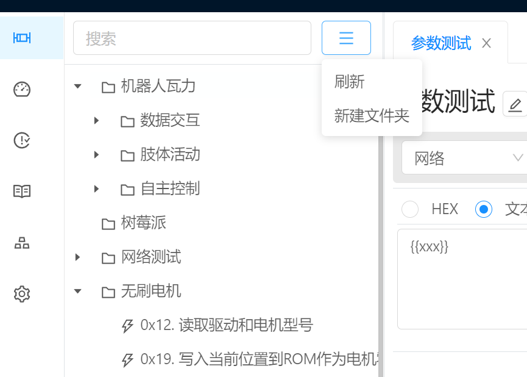
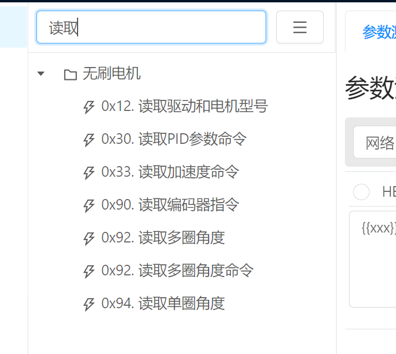
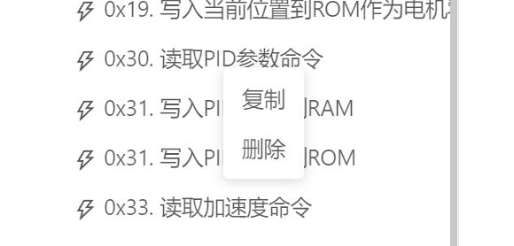
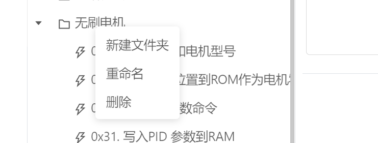

# 指令管理 / 目录操作

面板左侧为指令目录，可通过该目录对指令进行分类，过滤，移动，复制，删除等操作。

指令目录在存储上并没有进行软件限制，可以创建任意多个文件夹以及指令条目。并且没有层级限制。

## 搜索 / 过滤

通过该搜索框进行快速指令定位，当在文本框输入文本后，在目录部分将仅列出符合匹配条件的指令信息。

## 刷新

用于刷新指令文件夹，重新渲染指令目录

## 新建文件夹

工具菜单上的新建文件夹用于创建一级文件夹，如果需要对文件夹创建子文件夹，则需要在文件夹上右键选择创建文件夹操作。

输入文件夹名称后，点击保存即可成功创建文件夹。

## 指令条目

点击指令条目即可打开该指令并进行操作，右键指令条目则可以弹出右键菜单针对指令进行操作。

`复制`  点击复制选项则可以复制选中指令，复制的指令会在当前文件夹下，并切名称将会增加“副本”标记

`删除`  点击删除选项则可以在确认后删除该指令。

## 文件夹条目

右键文件夹条目即可出现文件夹右键操作菜单。

`新建文件夹` ：该选项可用于在选中文件夹下创建子文件夹。

`重命名` ： 该选项用于修改文件夹名称。

`删除` : 该选项用于删除该文件夹以及该文件夹下的所有指令数据。