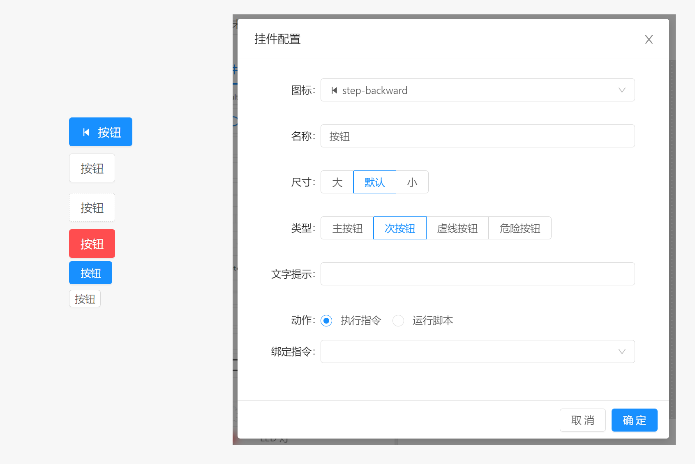

# 面板 / 组件 / 按钮

按钮组件可用于执行指令请求或者运行脚本。当配置完成后，每次点击按钮即可执行对应的指令或者脚本。

- `图标` ：显示在按钮文本左侧的图形元素，可简单明了的展示按钮的作用。
- `名称` ：显示在按钮中的文本内容，可作为按钮名称显示，来说明按钮作用。
- `尺寸` ：按钮显示大小模式，支持大，默认，小三种模式
- `类型` ：按钮界面类型，支持主按钮，次按钮，虚线按钮以及危险按钮
- `确认消息` ：动作执行确认消息，当不为空时，用户点击按钮会弹出确认对话框，用户确认之后方执行绑定到按钮的动作。
- `文字提示` ：鼠标长时间停留在按钮上时显示的提示文本内容。
- `动作` ：点击按钮时执行的操作类型，支持 执行指令或运行脚本， 动作配置参考 `组件` 说明。

