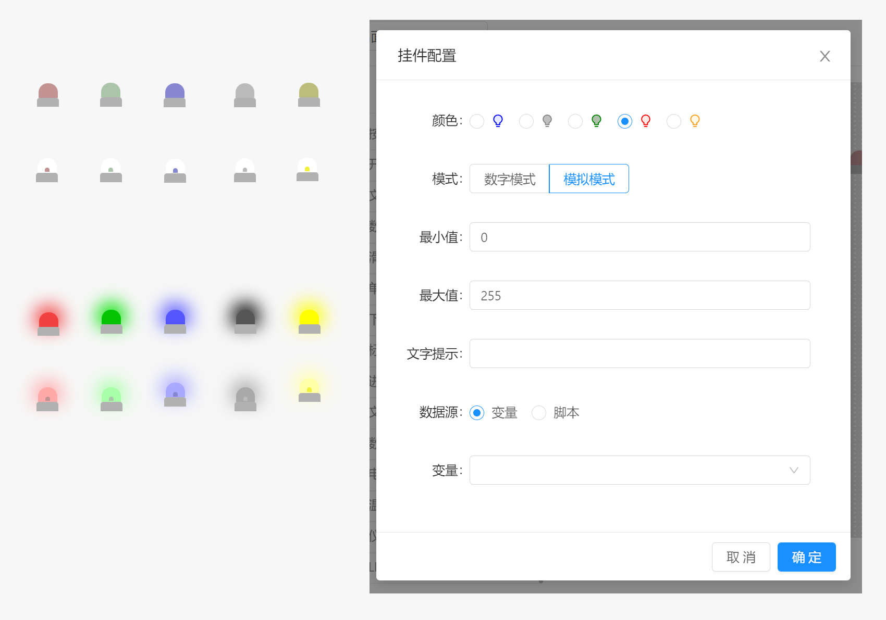

# 面板 / 组件 / LED

LED 组件用于模拟LED灯珠的效果，根据配置和运行取值显示不同的亮度或者颜色。

- `颜色` : 配置当灯珠亮起时显示的颜色
- `模式` ：配置灯珠模式，支持数字模式和模拟模式两种，在数字模式时，如果取值为0，则灯珠熄灭，非0则灯珠亮起。模式模式下则根据最大值和最小值做映射不同的亮度。当达到最小值时灯珠熄灭。
- `最小值` : 仅在模拟模式下起作用，配置灯珠接受的最小值。当取值小于最小值时，以最小值计算。
- `最大值` ： 尽在模拟模式下起作用，配置灯珠接受的最大值，当取值大于最大值时，以最大值计算。
- `文字提示` ： 当鼠标长时间停留在灯珠上时显示的提示文本信息
- `数据源` ：配置灯珠显示的数据源，支持变量和脚本两种方式。

