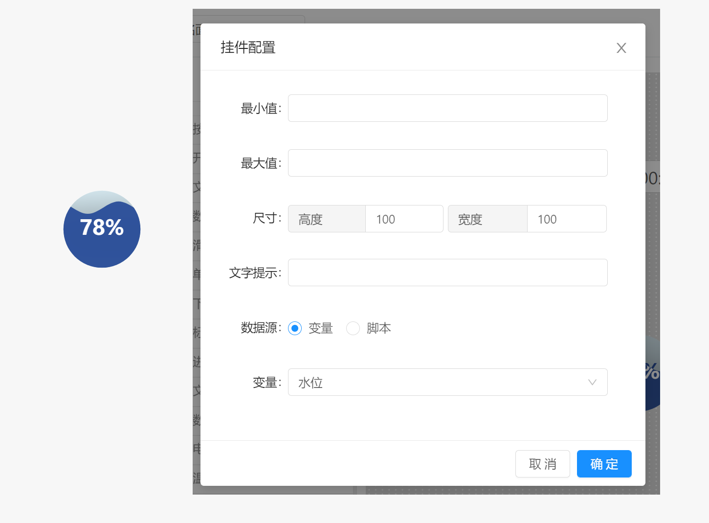

# 面板 / 组件 / 水球

水球组件可用于展示水位信息，其工作方式同进度条类似，通过配置最大值和最小值将获取的数据映射到该范围。

- `最小值` : 配置组件接受的最小值，当取值小于该值时以最小值处理。
- `最大值` :  配置组件接受的最大值，当取值大于最大值时以最大值处理。
- `尺寸` :  配置组件显示时的尺寸大小。
- `文字提示` :  当鼠标长时间停留在该组件上时显示的文本提示信息。
- `数据源` : 配置该组件的数据来源，支持变量和脚本两种。