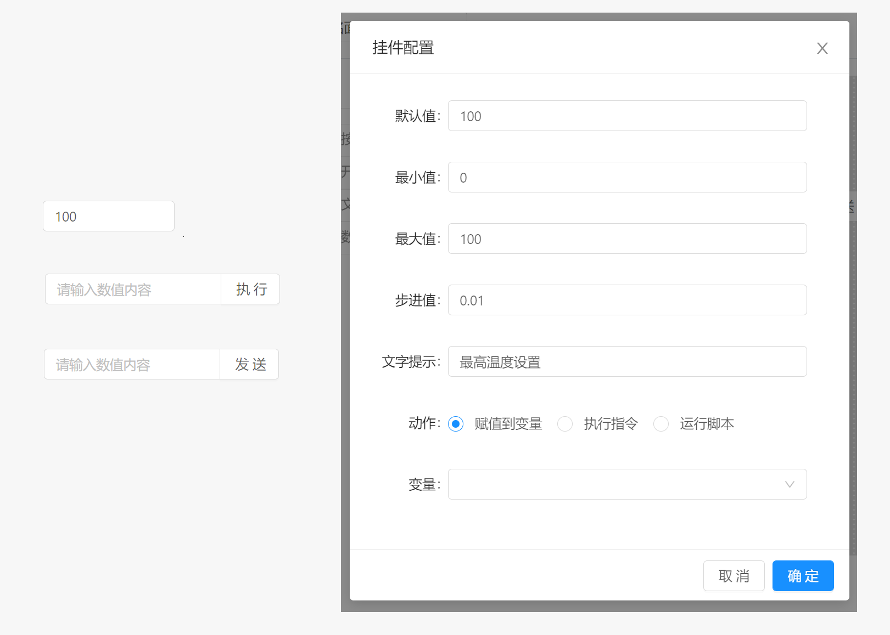

# 面板 / 组件 / 数值输入

当输入框动作为赋值到变量时，用户在文本输入框输入的数值内容会自动同步到指定的变量中。

当输入框动作为执行指令，或者运行脚本时，仅有当用户点击输入框后方动作执行按钮时才会执行动作。

数值输入框组件属于输入型组件，该组件的值由当前输入框中数值内容决定。

## 配置属性

- `默认值` ：数值输入框的默认值。当输入框被初始化后所存在的值。
- `最小值` ：数值输入框可接受的最小值。
- `最大值` ：数值输入框可接受的最大值。
- `步进值` ：在使用鼠标进行微调数值时，数值增大或减小的步进值。
- `尺寸` ：数值输入框的尺寸模式，用于改变输入框显示时的小大，支持`大`，`默认`，`小` 三种模式
- `文字提示` : 当鼠标长时间停留在组件上时显示的提示文本内容。
- `动作` ：点击按钮时执行的操作类型，支持赋值到变量，执行指令或运行脚本， 动作配置参考 `组件` 说明。

