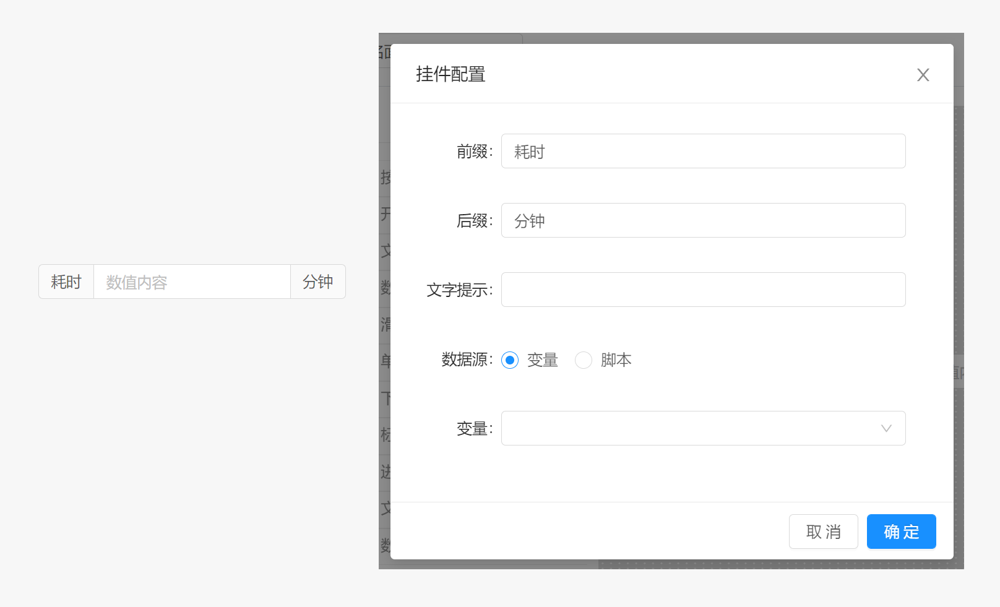

# 面板 / 组件 / 数值查看器

数值查看器用于查看数值数据

## 属性配置

- `前缀` : 数值查看器前缀文本内容
- `后缀` : 数值查看器后缀文本内容
- `尺寸` ：数值查看器的尺寸模式，用于改变组件显示时的小大，支持`大`，`默认`，`小` 三种模式
- `文字提示` :  当鼠标长时间停留在该组件上时显示的文本提示内容。
- `数据源` :  配置该数值查看器的数据来源，支持变量和脚本两种。