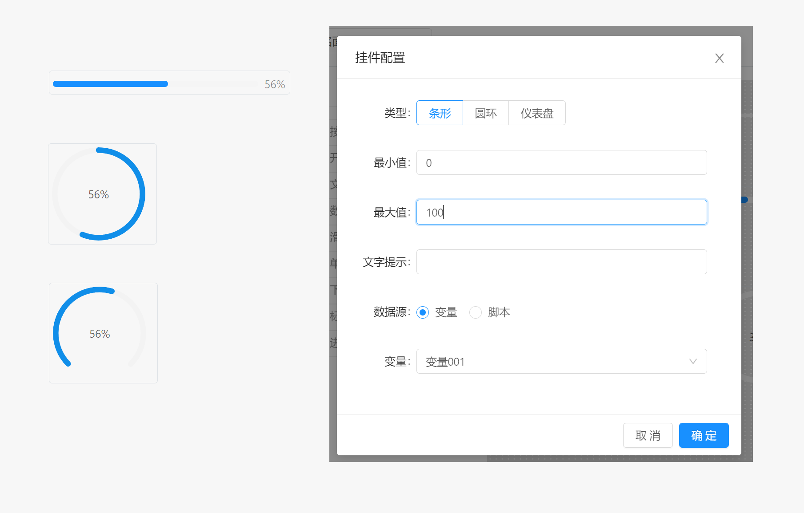

# 面板 / 组件 / 进度条

进度条组件为输出组件，当面板中变量发生变化时，即可触发该组件的刷新操作，从而显示出百分比数据。

当该组件从数据源获取到的值小于最小值时，则以最小值计算，当超出最大值时则按照最大值计算。

- `类型` : 进度条组件支持三种显示类型，分别为条形，圆形和仪表盘三种模式。
- `最小值` ：设置进度条接受的最小值
- `最大值`：设置进度条接受的最大值
- `文字提示`：当鼠标停留在该组件上时显示的提示文本内容。
- `数据源`：当组件刷新时，数据源的来源。 支持从变量获取，或者通过执行脚本获取。