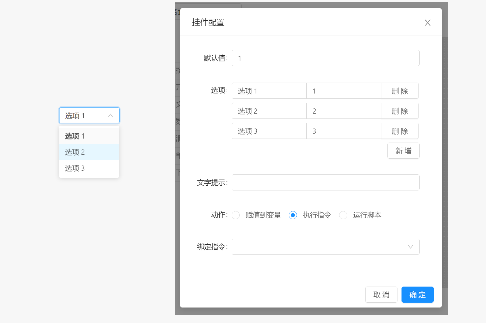

# 面板 / 组件 / 下拉框

下拉框组件用于在配置的多个选项中选择一个项目， 当用户选中一个项目后，将会执行绑定到该组件的动作。

下拉框组件属于输入型组件，该组件的值由当前选项内容决定。

## 配置属性

- `默认值` ：滑动条的默认值。当滑动条被初始化后所存在的值。
- `选项` ：选项为当前组件所支持的选项列表，文本用于展示后方取值编辑框用于编辑该选项的取值。可按照需要进行增加和删除。
- `尺寸` ：组件的尺寸模式，用于改变组件显示时的小大，支持`大`，`默认`，`小` 三种模式
- `文字提示` : 当鼠标长时间停留在组件上时显示的提示文本内容。
- `动作` ：点击按钮时执行的操作类型，支持赋值到变量，执行指令或运行脚本， 动作配置参考 `组件` 说明。