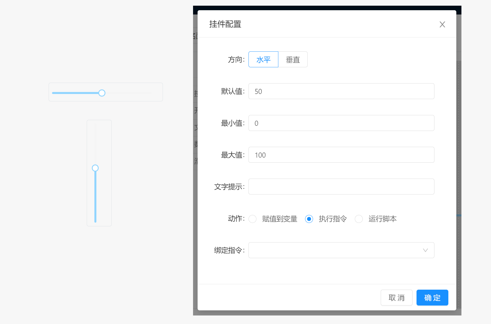

# 面板 / 组件 / 滑动条

当用户在完成滑动条拖动后，将执行配置到该组件的动作。

滑动条组件属于输入型组件，该组件的值由当前滑动条位置数值内容决定。

- `方向` ：滑动条支持水平和垂直两种显示方式。
- `默认值` ：滑动条的默认值。当滑动条被初始化后所存在的值。
- `最小值` ：滑动条最小值。
- `最大值` ：滑动条最大值。
- `文字提示` : 当鼠标长时间停留在组件上时显示的提示文本内容。
- `动作` ：点击按钮时执行的操作类型，支持赋值到变量，执行指令或运行脚本， 动作配置参考 `组件` 说明。