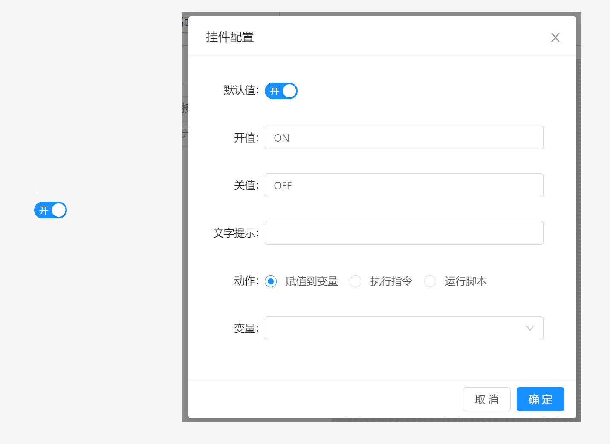

# 面板 / 组件 / 开关

当开关状态切换时，执行绑定到该组件的动作。 开关组件支持的动作类型有：赋值到变量，执行指令，运行脚本三种。

开关组件属于输入型组件，该组件的值由当前开关状态决定，取值内容为对应配置的 `开值` 或 `关值` 。

## 配置属性

- `默认值` ： 开关组件的初始值
- `开值` : 当开关状态切换到打开状态时，该组件的取值。
- `关值` ：当开关状态切换到关闭状态时，该组件的取值。
- `尺寸` ：组件的尺寸模式，用于改变组件显示时的小大，支持`大`，`默认`，`小` 三种模式
- `文字提示` : 当鼠标长时间停留在组件上时显示的提示文本内容。
- `动作` ：点击按钮时执行的操作类型，支持赋值到变量，执行指令或运行脚本， 动作配置参考 `组件` 说明。