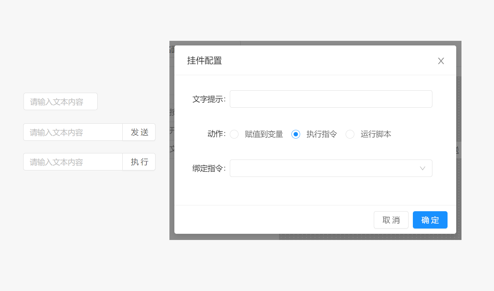

# 面板 / 组件 / 文本输入

当输入框动作为赋值到变量时，用户在文本输入框输入的文本内容会自动同步到指定的变量中。

当输入框动作为执行指令，或者运行脚本时，仅有当用户点击输入框后方动作执行按钮时才会执行动作。

文本输入框组件属于输入型组件，该组件的值由当前输入框中文本内容决定。

## 配置属性

- `尺寸` ：组件的尺寸模式，用于改变组件显示时的小大，支持`大`，`默认`，`小` 三种模式

- `文字提示` : 当鼠标长时间停留在组件上时显示的提示文本内容。
- `动作` ：点击按钮时执行的操作类型，支持赋值到变量，执行指令或运行脚本， 动作配置参考 `组件` 说明。

