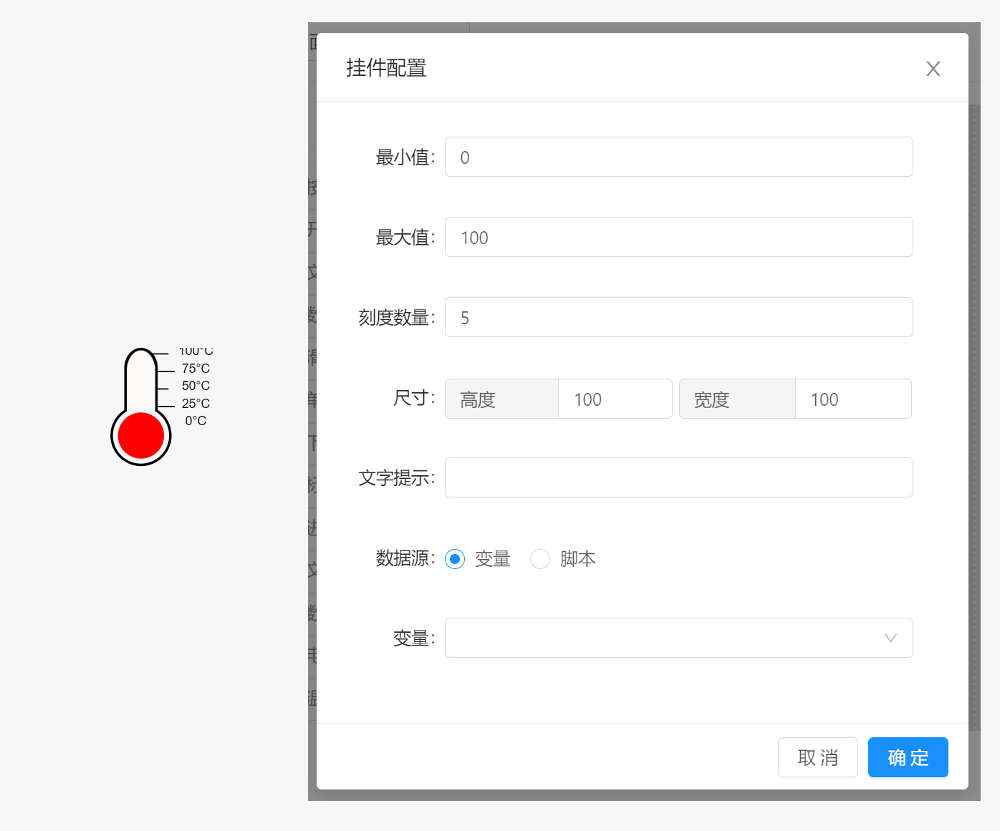

# 面板 / 组件 / 温度计

温度计组件可用于展示温度属性。

- `最小值` :  温度计组件接受的最小值，当数据小于最小值时，按照最小值处理
- `最大值` :  温度计组件接受的最大值，当数据大于最大值时，按照最大值处理
- `刻度数量` :  显示在温度计上的刻度数量
- `尺寸` : 温度计组件显示大小
- `文字提示` : 当鼠标停留在组件上时显示的文本提示内容。
- `数据源` : 温度计组件获取数据的数据源，支持变量和脚本两种方式。