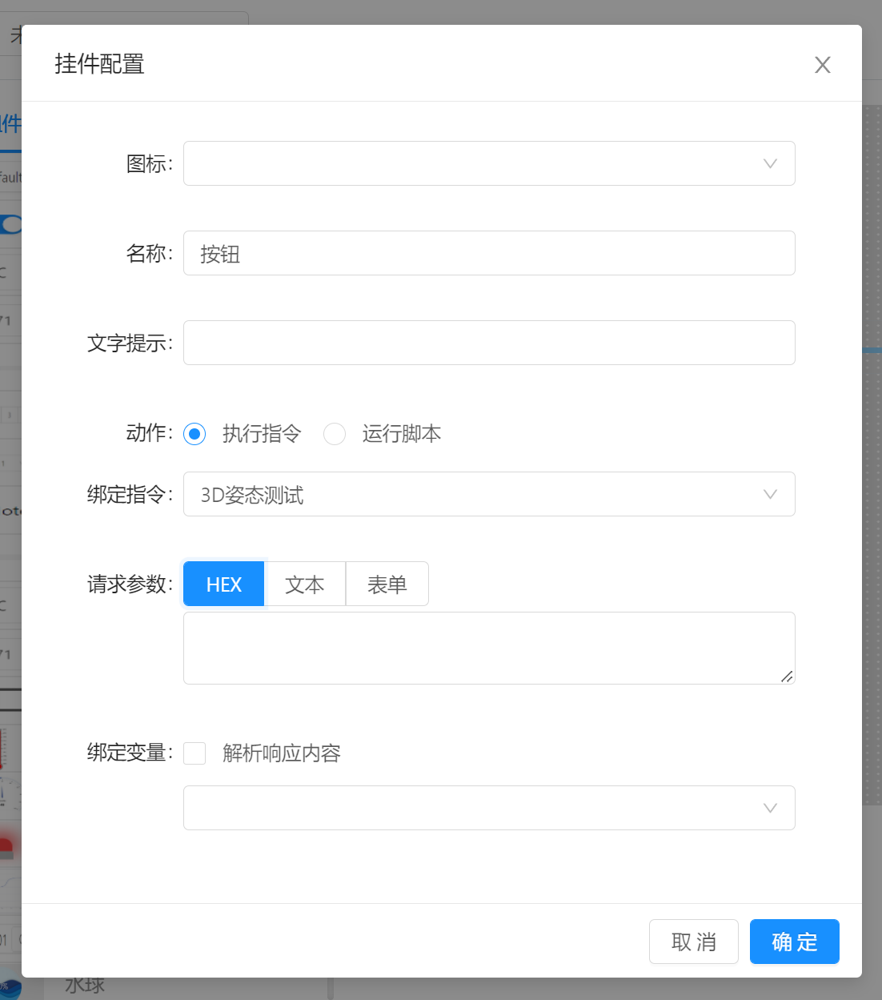
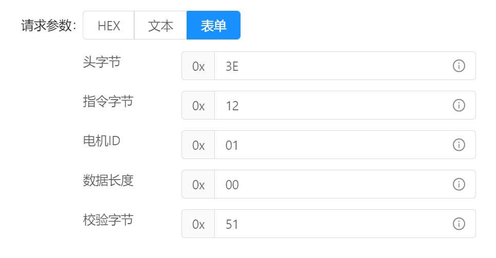
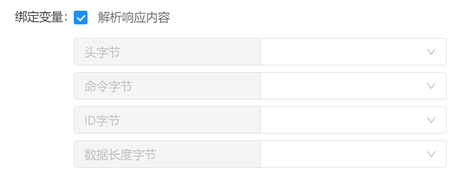

# 指令配置

当组件动作选择为 `执行指令` 时，就需要针对该指令请求参数进行配置。 例如：

## 请求参数配置

请求参数配置支持HEX，文本，表单三种方式，需要注意的如果绑定的指令并没有配置表单格式的参数数据，则无法使用表单格式参数编辑。

Hex ：通过输入十六进制文本进行组织参数内容，例如：`AA BB CC DD EE FF  00 12 34` 

文本：通过输入文本内容进行组织参数内容，例如：`how are you ?` 

表单：当指令本身配置了表单模板之后即可使用表单模式进行参数组织，例如：

表单中的默认参数为指令编辑时配置的参数内容。可根据需要随意修改。

## 请求参数占位符

再请求参数配置时，可使用两种占位符，`{{value}}` 和 `{{panel.变量名}}`

`{{value}}` : 表示当前组件的值，例如当前为滑动条时， `{{value}}` 即表示当前滑动条的取值。

`{{panel.变量名}}` : 是将运行时变量插入当前位置，例如运行时变量 `温度`, 使用时即可写为 `{{panel.温度}}`

## 响应处理

响应处理默认不解析响应结果，而是将素有响应内容作为一个结果来处理。

当指令配置了格式化响应的表单，则可以使用解析响应内容的方式来将响应结果解析到结构化数据中。 并可根据需要将每个字段属性分别分配给不同的变量。