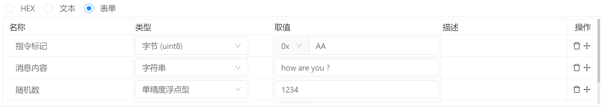

## 组件脚本

当组件动作或者数据源设置为脚本时， Bittly 会通过运行自定义的脚本来完成组件动作或者为组件设置计算数据。

在脚本中可以使用一些固定对象， 一个是 `bittly` 用于执行操作，一个是`project` 来调用项目全局脚本，另外一个是 `$this` 用于获取当前组件信息。

## `bittly` 对象

bittly 对象用于执行一些全局操作，例如执行指令，获取运行时变量，设置运行时变量，以及其他一些常用的操作方法等。

其中， 带有 `async` 的方法在调用时，如果调用顺序很重要，则需要使用 `await` 关键字来等待其完成， 否则在调用该方法时，虽然会被执行，但顺序是不定的， 例如：

```javascript
// 执行顺序为 ： 设置变量1为1，延时1秒，再设置变量1的值为2
bittly.variableSet("变量1",1);
await bittly.msleep(1000);
bittly.variableSet("变量1",2);

// 执行顺序为： 设置变量1为1，设置变量1为2，最后执行延时操作
// 注意：此时的延时虽然会被执行，但是在执行完非 `async` 方法之后才会去执行的。 
// 使用 await 关键字会等待 async 方法执行完成之后再继续执行之后的操作。
bittly.variableSet("变量1",1);
bittly.msleep(1000);
bittly.variableSet("变量1",2);

// 执行顺序不重要时，可省略 await 关键字，例如执行两条完全不相互影响的指令并且通讯配置不同时可省略
bittly.directiveExecText("echo", "how are you"); // 假设通讯串口为COM1
bittly.directiveExecText("text", "hello"); // 假设通讯串口为 COM2
```


### variableSet

`bittly.variableSet(name, value)`

设置运行时变量值

参数信息：

- `name` : 变量名称
- `value` : 变量值 

例如：

```javascript
// 设置数值
bittly.variableSet("温度",0);

// 设置字符串
bittly.variableSet("消息", "hello");
```


### variableGet

`bittly.variableGet(name, defaultValue)`

获取运行时变量值

参数信息：

- `name` : 变量名称
- `defaultValue` ：[可选] 当变量不存在时，获取该变量的值

返回值：返回指定运行时变量的值。

例如：

```javascript
// value = 0
let value = bittly.variableGet("温度");

// value2 = "hello"
let value2 = bittly.variableGet("消息");
```


### directiveExecText

`async bittly.directiveExecText( directiveName, params, responseCallback )`

执行指令，并传递字符串类型参数

参数信息：

- `directiveName` ：指令名称，指令名称可以时单独的指令名称，例如 `测试指令` 或者是全路径指令名称，例如： `串口测试/测试指令`, 这种格式下最后一个元素为指令名称，指令名称之前为文件夹名称。需要注意的是，当存在相同名称指令时，将会任选其中一个执行。
- `params` : 文本参数
- `responseCallback ` ：[可选] 响应回调函数

例如：

```javascript
// 不处理响应结果
await bittly.directiveExecText("echo", "how are you ?");

// 将结果转换为字符串并赋值到变量
await bittly.directiveExecText("echo", "how are you ?", ( response ) => {
    let text = bittly.responseReadAsText(response);
    bittly.variableSet("消息", text);
});
```


### directiveExecHex

`async directiveExecHex( directiveName, params, responseCallback )`

执行指令，并传递HEX字符串作为参数

参数信息：

- `directiveName` ：指令名称，指令名称可以时单独的指令名称，例如 `测试指令` 或者是全路径指令名称，例如： `串口测试/测试指令`, 这种格式下最后一个元素为指令名称，指令名称之前为文件夹名称。需要注意的是，当存在相同名称指令时，将会任选其中一个执行。
- `params` : 十六进制字符串参数
- `responseCallback ` ：[可选] 响应回调函数

例如：

```javascript
// 不处理响应结果
await bittly.directiveExecHex("echo", "AA BB CC DD EE FF 00");

// 将结果转换为字节数组，并取第一个字节赋值到变量
await bittly.directiveExecText("echo", "AA BB CC DD EE FF 00", ( response ) => {
    let bytes = bittly.responseReadAsBytes(response);
    bittly.variableSet("字节", bytes[0]);
});
```


### directiveExecForm

`async directiveExecForm( directiveName, params, responseCallback )`

执行指令，并传递表单参数， 当指令没有配置表单参数时，该方法将会调用失败。

参数信息：

- `directiveName` ：指令名称，指令名称可以时单独的指令名称，例如 `测试指令` 或者是全路径指令名称，例如： `串口测试/测试指令`, 这种格式下最后一个元素为指令名称，指令名称之前为文件夹名称。需要注意的是，当存在相同名称指令时，将会任选其中一个执行。
- `params` : 表单参数，表单参数为一个数组，数组中每个元素代表者表单中对应条目的值属性。
- `responseCallback ` ：[可选] 响应回调函数

示例：

假设参数表单为：



```javascript
// 不处理响应结果
await bittly.directiveExecForm("echo", ["AA", "how are you ?", "1234"]);

// 将结果转换为表单
await bittly.directiveExecText("echo", "AA BB CC DD EE FF 00", ( response ) => {
    let responseForm = bittly.responseReadAsForm(response);
    // 取第一个元素赋值到变量
    bittly.variableSet("标记", responseForm.getValueByIndex(0));
    // 如果响应格式化配置了名称，则可以通过名称获取值
    bittly.variableSet("标记", responseForm.getValueByName("响应标记"));
});
```


### msleep

`async bittly.msleep( time ) `

延时指定毫秒数

参数信息：

- `time` ： 延时的毫秒数

例如：

```javascript
// 延时1秒
await bittly.msleep(1000);
```


## `project` 对象

`project` 对象用于调用项目全局脚本，当配置了项目脚本时，可通过 `project.方法名()` 进行调用，例如存在项目脚本：

```javascript
project.hello = function ( name ) {
    return name;
};
```

即可在组件脚本中调用：

```javascript
let val = project.hello("sige");
// val = "sige"
```


## `$this` 对象

`$this` 对象用于获取当前组件信息。 不同的组件可能会有不同的操作方法，详情请参考组件说明文档

**`$this.valueGet()`**

获取组件值，例如文本输入，下拉框，滑动条等组件可使用该方法获取当前组件值。

```javascript
// 文本输入组件
let text = $this.valueGet();

// 下拉框
let option = $this.valueGet();
```

**`$this.dataSet(name, value)`** 

设置组件数据，例如进度条，地图，水球图等可通过脚本设置组件值。

```javascript
// 温度计
$this.dataSet("value", 100)
```

