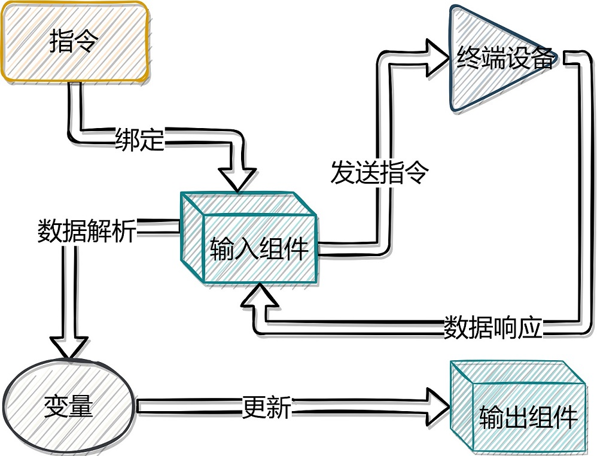

# 面板 / 组件

组件是构成面板的基本元素，例如按钮，下拉框，文本输入都是一个个组件。当用户操作组件时，会执行对应的绑定到该组件的指令，或者动作，或者脚本， 从而实现界面交互，其执行流程如下图所示：

## 组件的分类

目前组件有两种，一种是输入类组件，用于触发事件，例如按钮，下拉框，滑动条这些。用户通过这些组件来触发事件从而操作终端设备。 另外一种是展示类组件，例如波形图，文本显示，地图等组件，用于从数据源获取数据并展示给用户。

## 动作配置

组件动作指的是当用户点击按钮，拖拽滑动条或者改变单选选项时所执行的操作。 该配置适用于输入类组件，例如按钮，下拉框等。

目前支持的动作有： 执行脚本，执行指令 以及赋值到变量三种。

[**执行脚本**](/manual/panel-widgets-script) ：当用户触发组件事件时，组件执行用户自定义的脚本。

[**执行指令**](/manual/panel-widgets-directive-config)：当用户触发组件事件时，组件根据配置的参数执行绑定到该组件的指令。

**赋值到变量** ：当用户触发该组件事件时，组件将当前组件的值赋值到用户配置的变量中。

## 数据源配置

对于展示类组件，例如地图，文本显示等组件需要配置其显示数据来源。 目前支持的数据源有变量和脚本两种方式。

**变量** ：组件展示的数据源来自于用户配置的变量，当变量数据发生变化时，组件刷新展示。

[**脚本**](/manual/panel-widgets-script) ：每次面板刷新状态时，组件通过执行用户配置的脚本来刷新自身的显示。

## 组件列表

-  [按钮](/manual/panel-widget-button)
-  [开关](/manual/panel-widget-switch)
-  [文本输入](/manual/panel-widget-text-input)
-  [数值输入](/manual/panel-widget-number-input)
-  [滑动条](/manual/panel-widget-slider)
-  [单选](/manual/panel-widget-radio)
-  [下拉框](/manual/panel-widget-select)
-  [标签](/manual/panel-widget-label)
-  [进度条](/manual/panel-widget-progress-bar)
-  [文本查看](/manual/panel-widget-text-viewer)
-  [数值查看](/manual/panel-widget-number-viewer)
-  [电池](/manual/panel-widget-battery)
-  [温度计](/manual/panel-widget-thermometer)
-  [仪表盘](/manual/panel-widget-gauge)
-  [LED 灯](/manual/panel-widget-led)
-  [折线图](/manual/panel-widget-line-chart)
-  [定时器](/manual/panel-widget-timer)
-  [水球](/manual/panel-widget-liquidfill)
-  [终端](/manual/panel-widget-terminal)
-  [角度指示器](/manual/panel-widget-angle-indicator)
-  [偏移角度指示器](/manual/panel-widget-offset-angle-indicator)
-  [分组框](/manual/panel-widget-groupbox)
-  [地图](/manual/panel-widget-map)
-  [3D姿态查看器](/manual/panel-widget-3d-orientation-viewer)