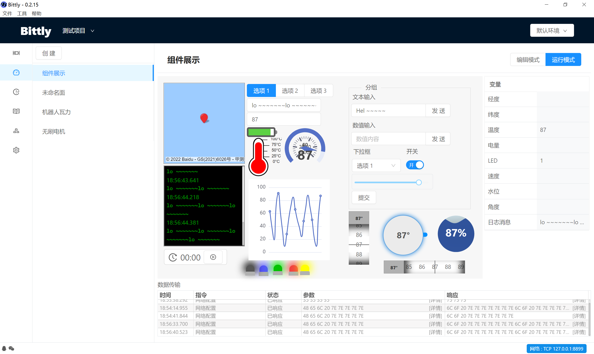
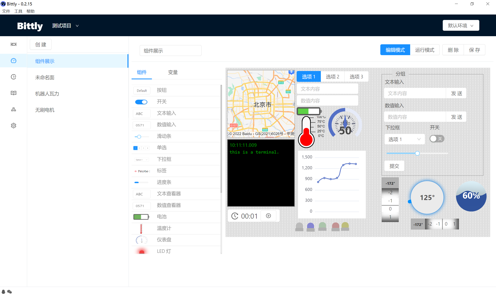

# 面板管理

面板用于快速构建一个上位机操作界面，面板由编辑模式和运行模式组成。 编辑模式用于配置面板组件，绑定指令到组件上。运行模式是在面板配置完成之后，根据配置的操作来完成界面UI的展示。

## 运行模式

面板用于将指令绑定到指定的组件上， 并通过交互的方式例如点击，拖拽，或者输入数据等方式来触发指令发送，解析与显示。

## 编辑模式

编辑模式下可通过将组件库中的组件拖放到面板位置上来放置组件，放置完成后将会弹出组件配置对话框用于配置该组件。