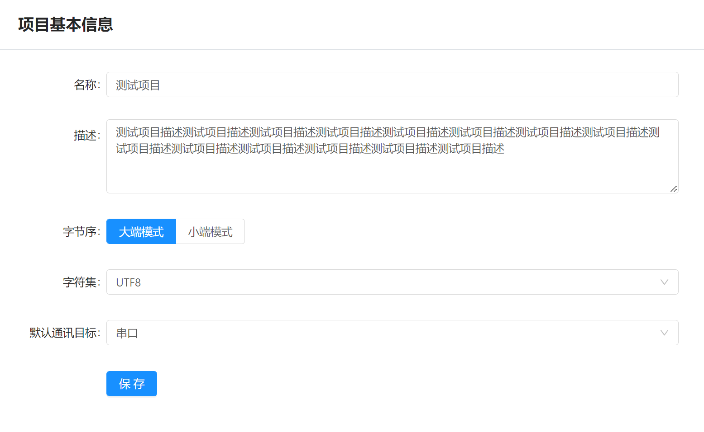

# 项目管理 / 基础配置

项目基本信息配置界面用于配置项目基础信息，可方便后续项目测试与运行。

- `名称` : 项目名称，可用于项目切换时显示以及文档输出等，当项目发布到远程服务器后，项目名称将会显示在项目列表中.
- `描述` : 项目描述信息，在项目输出时会取得项目描述信息进行显示，以及将项目发布到远程后，项目信息将会对外进行展示，说明项内容。
- `字节序` : 指令创建时指定的默认字节序方式, 但是已经创建的指令不会受到影响.
- `字符集` : 指令创建时指定的默认字符集,但是已经创建的指令不会受到影响.
- `默认通讯目标` : 指令创建时,默认指定的通讯目标.