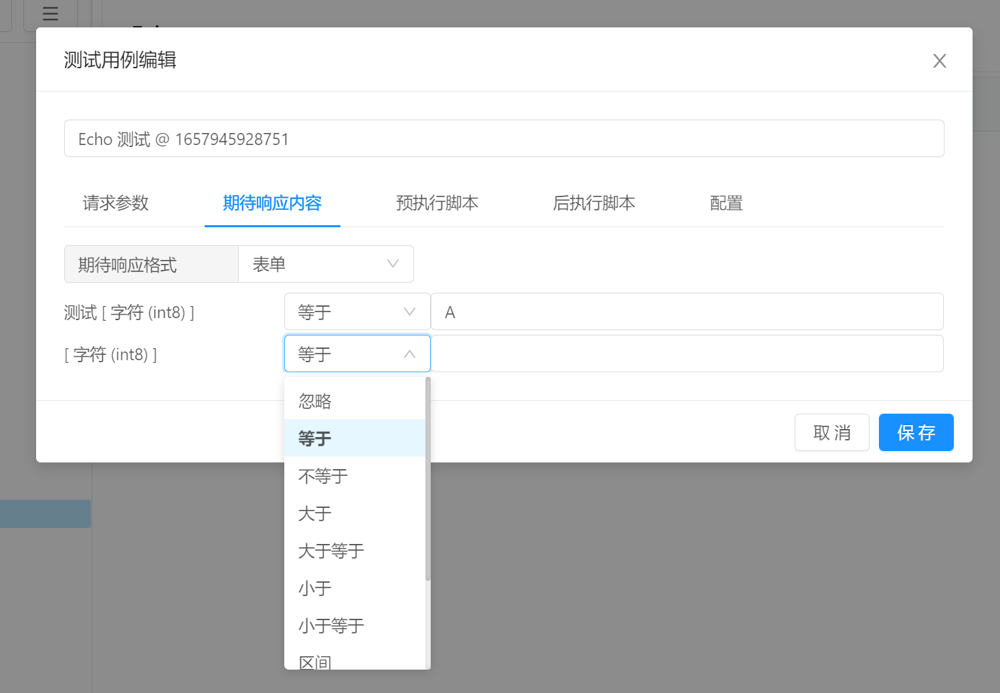
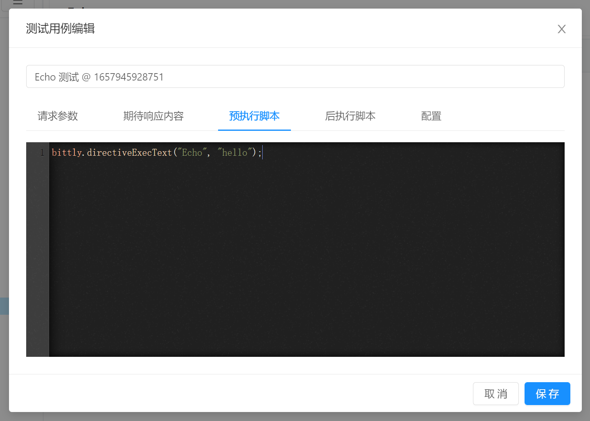
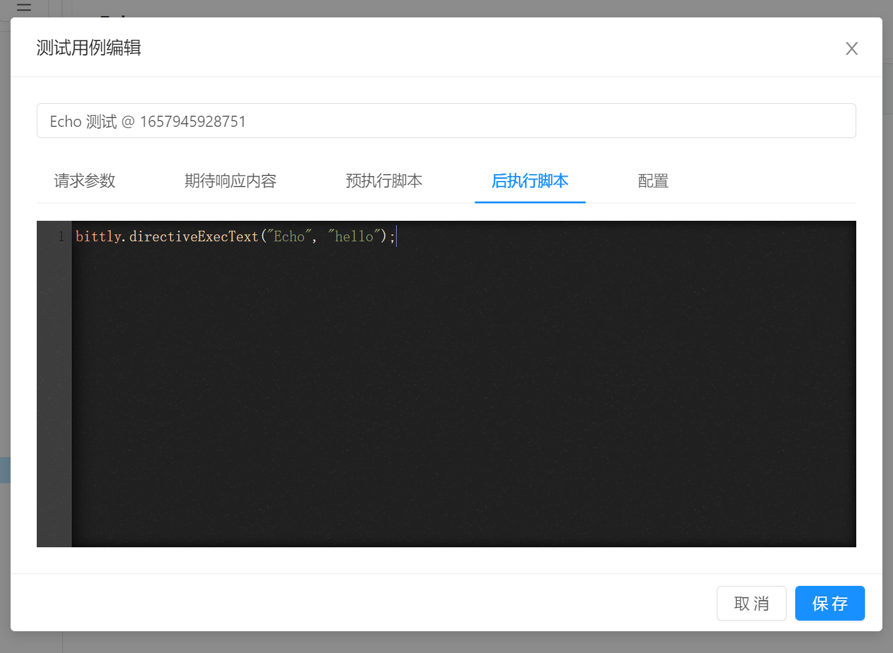
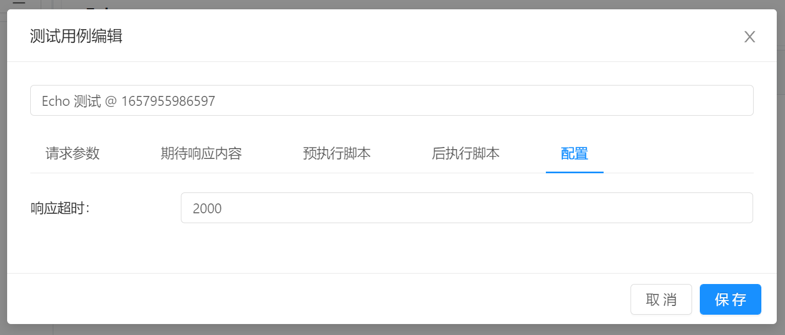

# 测试管理 / 测试用例编辑

点击 `创建测试用例` 按钮之后弹出测试用例编辑弹框，在该弹框编辑测试用例信息。

## 请求参数

请求参数标签用于编辑指令发送的参数数据，支持文本，HEX和表单三种构建格式。 

需要注意的是， 表单格式仅仅在指令配置了表单之后才可以使用表单模式。


## 期待响应内容

期待相应内容标签用于配置当指令执行完毕之后，应当响应的数据格式。

目前支持字符串，HEX和表单三种，需要注意的是，表单仅仅在配置了指令响应格式化表单之后才可以使用。

`字符串` :  当配置为字符串时，指令响应的内容要和配置的字符串内容完全一致，方可通过测试。

`HEX` ： 当配置为HEX的时候，指令响应的内容和配置的HEX字符串转换为字节数据之后的内容一直，方可通过测试。

`表单` ：当配置为表单时，需要针对每个属性配置对比操作符，以及对比的数据内容。当响应的数据格式化之后，通过与配置的期待响应内容进行对比，对比完成后，如果完全匹配则通过测试。




## 预执行脚本



预执行脚本是在该测试用例执行之前执行的一段脚本内容，主要用来准备测试环境。例如执行一些初始化指令等。当预执行失败时，测试用例不再继续执行并标记为失败。

在编写脚本时，可以使用到 `bittly`, `$this` 以及 `project` 三个对象。

`bittly` 主要用于执行全局方法，例如执行指令，解析指令结果。

```javascript
// 执行指令并传递文本参数
bittly.directiveExecText("path/to/directive", "ABC", ( response ) => {
    // 将响应解析为字符串
    let text = bittly.responseReadAsText(response);
});

// 执行指令并传递十六进制参数
bittly.directiveExecHex("path/to/directive", "AA BB CC FF 11 22", ( response ) => {
    // 将响应数据解析为字节数组
    let bytes = bittly.responseReadAsBytes(response);
    // bytes[0] => 第一个字节
});

// 执行指令并传递表单格式参数
bittly.directiveExecForm("path/to/directive", ["AA","how are you ?"], ( response) => {
  	// 将响应数据解析为对象
    let result = bittly.responseReadAsForm(response);
    // result.getValueByIndex(0) 根据索引号获取值
    // result.getValueByName("指令ID") 根据名称获取值
});
```

`$this` 代表当前测试用例，可控制测试用例执行的过程，例如中断或者获取状态。

```javascript
// 终止执行
$this.abort();

// 获取测试用例状态, 可能的取值为 : 'failed', 'passed', 'aborted', 'timeout'
$this.statusGet();
```

`project` 则是用来调用项目脚本的方法，例如 `project.hello()` 


## 后执行脚本



后执行脚本是当测试用例执行完毕之后执行的脚本，主要用来清理测试环境，例如执行一条指令来关闭目标对象。  后执行脚本无论测试用例执行失败或者成功都会执行。同时，后执行脚本无论是执行失败或成功，都不影响测试用例的状态。

后执行脚本的书写可参考预执行脚本。


## 配置



`响应超时时间` ：当超过该时间仍然没有响应的话，则该指令测试失败。 