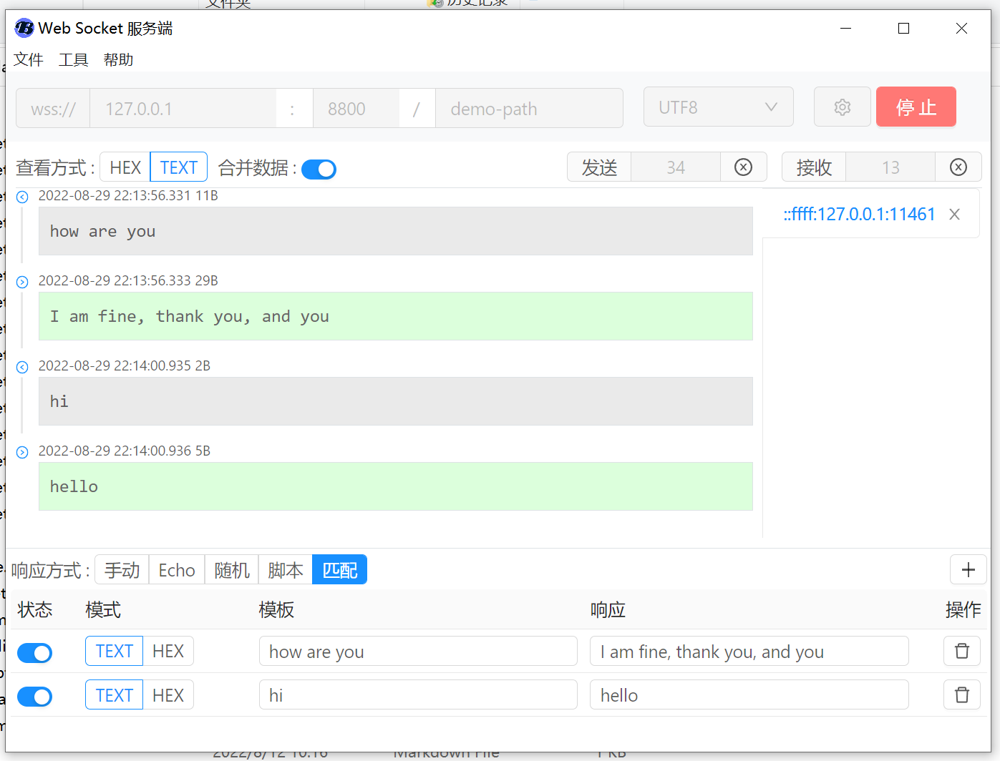
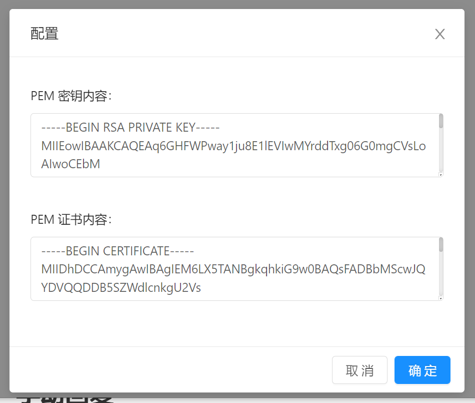
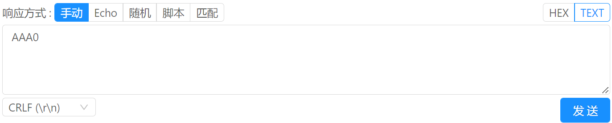
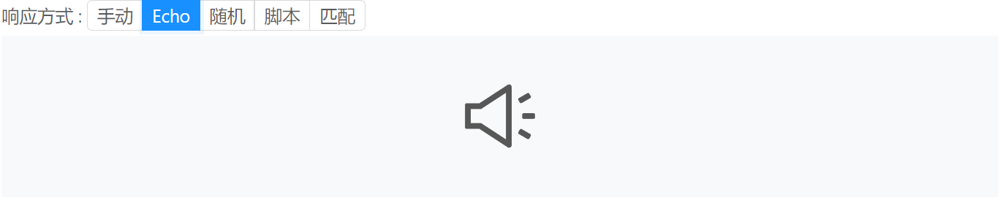
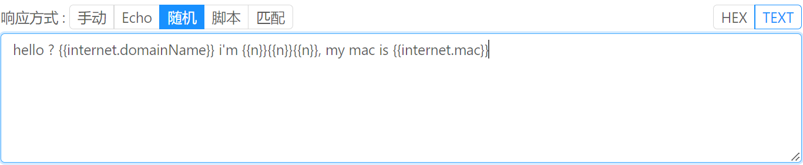
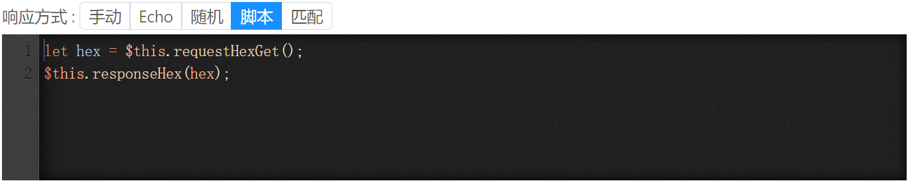
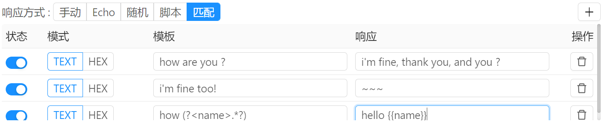

# 小工具 / WebSocket 服务端



WebSocket 服务端小工具用于创建一个可以同时接受多个客户端连接的 WebSocket 服务端。 

配置说明：

- 协议 ：支持 `ws` 和 `wss` 两种协议，可点击协议下拉框进行选择。 默认为`ws` 协议。
- 地址：配置服务器监听的地址。
- 端口：配置服务器监听的端口。
- 路径：配置 websocket 服务器通讯路径。
- 字符集 ：配置通讯过程使用的字符集。


## wss 配置



如果需要启用 wss 协议，还需要配置一些证书内容。

这里介绍一种比较方便的配置方式：

1. 通过 [在线生成自签名工具](https://regery.com/en/security/ssl-tools/self-signed-certificate-generator) 生成证书。
2. 通过 [OpenSSL在线生成合成PEM文件](https://www.myssl.cn/tools/merge-pem-cert.html) 将证书转为 PEM 格式。
3. 将对应的密钥和证书内容填充到配置文本输入框中。
4. 将步骤1产生的证书文件安装到系统中。
5. 配置完成后即可启动 wss 服务器。


## 手动回复



手动回复需要手动填写回复内容,并且只能回复到当前激活的客户端中.


## Echo模式



echo 模式将响应任何收到的内容,并且不做其他处理


## 随机模式



随机模式用于自动响应随机内容,通过配置随机模板来产生随机内容, 如果模板为空,则随机响应一个字符. 随机模板示例:

```
the random number is : {{n}}{{n}}{{n}}
```

则响应的数据可以为 :

```
the random number is : 153
```

支持的随机数据标识符如下:

- `{{n}}` : 随机数1位 0 - 9 
- `{{a}}` : 小写字母1位 a - z 
- `{{A}}` : 大写字母1位 A - Z

-  `{{hex}}` : 十六进制字符1位 0-9 A-F
- `{{byte}}` : 十六进制字符2位 0-9 A-F
- `{{internet.domainName}}` : 主机地址, 例如 `muddy-neuropathologist.net`
- `{{internet.domainSuffix}}` : 域名后缀,例如 `com`
- `{{internet.email}}` : 邮箱地址
- `{{internet.httpStatusCode}}` : HTTP 状态码 ,例如 `404`
- `{{internet.ip}}` : ip 地址
- `{{internet.ipv4}}` : ipv4 地址
- `{{internet.ipv6}}` : ipv6 地址, 例如: `269f:1230:73e3:318d:842b:daab:326d:897b`
- `{{internet.mac}}` : MAC 地址, 例如: `89:bd:9d:8d:69:a6`
- `{{internet.url}}` , URL 链接, 例如 : `https://optimistic-rabbi.org`

 更多参考标识符参考 https://fakerjs.dev/guide/

## 脚本模式



通过书写执行脚本来自动生成响应内容, 例如:

```javascript
// 将收到的数据再发送回去
let hex = $this.requestHexGet();
$this.responseHex(hex);
```

方法说明:

```javascript
// 获取十六进制请求字符串
let hex = $this.requestHexGet();

// 获取请求字节数组
let bytes = $this.requestBytesGet();
// 可通过下表获取每个字节的数据
let firstByte = bytes[0];

// 获取请求文本数据
let text = $this.requestTextGet();

// 响应十六进制字节数据
$this.responseHex("AA BB CC DD");

// 响应文本数据
$this.responseText("how are you ?");

// 响应字节数据
$this.responseBytes(bytes);
```


## 匹配模式



匹配模式是将请求作为字符串来处理，字节类型请求数据则会转换为 HEX 字符串之后进行匹配处理。 

在匹配时，每条规则的匹配模板需要全部匹配到请求内容。例如请求内容为 : `12345` ，则匹配模板 `12345` 可以匹配， `1234` 不可以匹配， `1.*5` 可以匹配。

匹配方式为正则匹配，即每个模板都会生成一个正则表达式来进行计算， 例如模板 `1234`， 则会生成的正则表达式为 `^1234$` 。

当遇到第一个匹配规则时，则直接进行回复，不再继续往下匹配。 

响应内容支持插入匹配结果，匹配结果可通过索引号，或者分组名称来使用， 使用`{{1}}` 来引入索引结果，使用`{{name}}` 来引入分组结果。例如：

```
模板 1：how are you
模板 2：how (are) you
模板 3：how (?<who>are) you
```

则响应内容可配置为：

```
模板 1 响应：{{0}}
模板 2 响应：{{0}} {{1}}
模板 3 响应：{{0}} {{1}} {{who}}
```

假设请求内容为 `how are you` ，则对方收到的内容为：

```
模板 1 响应：how are you
模板 2 响应：how are you are
模板 3 响应：how are you are are
```

另外，响应模板中支持使用随机占位符，例如：

```
{{1}} {{who}} {{internet.ip}} {{byte}}
```

那么， `{{1}}` 为引用正则匹配的分组结果， `{{who}}` 为引用正则分组的名称， 如果该名称不存在，则会作为随机占位符来计算，例如, 如果正则匹配分组中不存在 `{{byte}}` 分组，则 `{{byte}}` 会作为一个随机占位符来生成一个随机的字节数据。 `{{internet.ip}}` 为直接使用随机占位符，用来生成一个随机的IP地址字符串。

关于随机占位符的说明，请参考响应模式中的 `随机模式`。